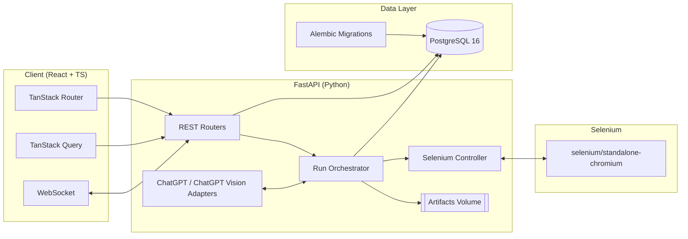

# CLAUDE.md

This file provides guidance to Claude Code (claude.ai/code) when working with code in this repository.

# JBTestSuite - Full-Stack Web Automation Platform

A complete full-stack application for web automation testing with AI integration.

## Architecture Overview



## Project Structure

```
JBTestSuite/
├── client/
│   ├── src/
│   │   ├── routes/          # File-based routing
│   │   ├── components/      # Reusable UI components
│   │   ├── hooks/           # Custom React hooks
│   │   ├── types/           # TypeScript type definitions
│   │   └── utils/           # Utility functions
│   ├── Dockerfile
│   └── package.json
├── server/
│   ├── src/
│   │   ├── api/             # FastAPI routers
│   │   ├── core/            # Core configuration
│   │   ├── models/          # SQLAlchemy models
│   │   ├── services/        # Business logic
│   │   ├── selenium/        # Browser automation
│   │   └── ai/              # AI integration
│   ├── alembic/             # Database migrations
│   ├── Dockerfile
│   └── pyproject.toml
├── docker-compose.yml       # Multi-service orchestration
└── README.md
```

## Development Commands

### Environment Setup (Required First Step)
Before running the application, set up environment variables:
```bash
# Copy example environment file
cp .env.example .env

# Edit with your actual values (required: POSTGRES_PASSWORD, OPENAI_API_KEY, SECRET_KEY)
nano .env  # or your preferred editor

# Generate secure values:
# Secret key: python -c "import secrets; print(secrets.token_urlsafe(32))"
# DB password: python -c "import secrets; print(secrets.token_urlsafe(16))"
```

See the README.md for complete environment setup instructions.

### Docker (Primary Development Method)
```bash
# Build and start all services (Client, Server, PostgreSQL, Selenium)
docker-compose up --build

# Stop all services
docker-compose down

# View logs for specific service
docker-compose logs -f [client|server|postgres|selenium]
```

Services run on:
- Client: http://localhost:3000
- Server API: http://localhost:8000
- API Docs: http://localhost:8000/docs
- PostgreSQL: localhost:5432
- Selenium Grid: http://localhost:4444

### Client (React/TypeScript)
From `client/` directory:
```bash
# Development server
npm run dev

# Build for production
npm run build

# Run tests
npm test

# Linting and formatting
npm run lint
npm run format
npm run check  # Format and fix lint issues
```

### Server (Python/FastAPI)
From `server/` directory:
```bash
# Install with dev dependencies
pip install -e ".[dev]"

# Start FastAPI server
uvicorn src.main:app --host 0.0.0.0 --port 8000 --reload

# Code quality tools
black src/           # Format code
isort src/           # Sort imports
mypy src/            # Type checking
pytest               # Run tests

# Database migrations
alembic upgrade head # Apply latest migrations
alembic revision --autogenerate -m "description"  # Create new migration

# Database setup in Docker
docker-compose exec server alembic upgrade head  # Apply migrations in Docker
docker-compose down -v  # Reset database (removes all data)
docker-compose up --build  # Fresh start with new database
```

## Core Features Implementation

### 1. Test Management
- CRUD operations for test cases with SQLAlchemy models
- Test case organization and categorization
- Test execution history and results tracking
- RESTful API endpoints for all test operations

### 2. Selenium Integration
- WebDriver management with selenium/standalone-chromium
- Screenshot capture during test execution
- Element interaction and validation methods
- Browser session handling and cleanup

### 3. AI Integration
- OpenAI API integration for test case generation
- ChatGPT Vision for screenshot analysis
- AI-powered test result interpretation
- Structured prompts for consistent AI responses

### 4. Real-time Features
- WebSocket connections for live test monitoring
- Real-time progress updates during execution
- Live screenshot streaming
- Connection management and broadcasting

### 5. Data Management
- PostgreSQL 16 with async SQLAlchemy 2.0
- Alembic migrations for schema versioning
- Proper database models and relationships
- Connection pooling and session management

## Technology Stack

### Server (FastAPI + Python)
- **FastAPI** with async/await patterns and dependency injection
- **SQLAlchemy 2.0** with async sessions
- **Alembic** for database migrations
- **PostgreSQL 16** as primary database
- **Selenium WebDriver** for browser automation
- **OpenAI API** integration (ChatGPT + Vision)
- **WebSockets** for real-time communication
- **Pydantic** models for data validation

### Client (React + TypeScript)
- **React 18+** with modern hooks and patterns
- **TanStack Router** for file-based routing
- **TanStack Query** for server state management
- **WebSocket** client for real-time updates
- **Tailwind CSS** for styling
- **TypeScript** with strict configuration

### Infrastructure
- **Docker** containers for all services
- **Docker Compose** for development orchestration
- **PostgreSQL** container with persistent storage
- **Selenium Grid** (standalone-chromium)
- **Volume mounting** for artifacts and development

## Environment Variables

The application uses environment variables for secure configuration. Key variables include:

| Variable | Description | Required |
|----------|-------------|----------|
| `SECRET_KEY` | Application secret key (auto-generated if not set) | Recommended |
| `POSTGRES_PASSWORD` | Database password | **Yes** |
| `OPENAI_API_KEY` | OpenAI API key for AI features | **Yes** |
| `ENVIRONMENT` | Application environment (`development`/`production`) | No |
| `CORS_ORIGINS` | Comma-separated list of allowed origins | No |

**Security Features:**
- Automatic secret key generation using `secrets.token_urlsafe(32)`
- Environment-based database configuration
- No hardcoded credentials in source code
- Separate `.env.example` files for reference
- Artifacts folder excluded from version control (screenshots, logs)

## Common Development Tasks

### First-Time Setup
1. Copy environment template: `cp .env.example .env`
2. Generate secure values and add to `.env`:
   ```bash
   python -c "import secrets; print('SECRET_KEY=' + secrets.token_urlsafe(32))"
   python -c "import secrets; print('POSTGRES_PASSWORD=' + secrets.token_urlsafe(16))"
   ```
3. Add OpenAI API key to `.env` file
4. Start services: `docker-compose up --build`
5. Apply database migrations: `docker-compose exec server alembic upgrade head`

### Testing WebSocket Functionality
WebSockets provide real-time updates during test execution:
- Test execution status changes
- Step-by-step execution logs
- Completion notifications
- Error reporting

Connection endpoint: `ws://localhost:8000/api/ws/test_updates`

### Debugging Common Issues
- **"relation test_cases does not exist"**: Run `docker-compose exec server alembic upgrade head`
- **WebSocket not connecting**: Check server logs for `"WebSocket /api/ws/test_updates" [accepted]`
- **OpenAI API errors**: Verify API key format starts with `sk-`
- **Selenium issues**: Check `docker-compose logs selenium`

## Code Conventions

### TypeScript/React
- Use TanStack Router file-based routing patterns
- Leverage TanStack Query for all server state
- Implement proper TypeScript types for all API responses
- Follow React best practices with custom hooks
- Use Tailwind CSS utility classes
- Prettier config: no semicolons, single quotes, trailing commas

### Python/FastAPI
- Use async/await patterns throughout
- SQLAlchemy 2.0 declarative syntax with async sessions
- Pydantic models for request/response validation
- Dependency injection for database sessions
- Proper error handling with HTTP status codes
- Use black, isort, and mypy for code quality

### Database
- Use Alembic for all schema changes
- Follow naming conventions for tables and columns
- Implement proper indexes for query performance
- Use database constraints for data integrity

## Key Dependencies

### Client
- `@tanstack/react-router`: File-based routing with type safety
- `@tanstack/react-query`: Server state management
- `tailwindcss`: Utility-first CSS framework
- `vitest`: Fast unit testing framework

### Server
- `fastapi[standard]`: Web framework with automatic docs
- `sqlalchemy[asyncio]`: Async database ORM
- `alembic`: Database migration tool
- `pydantic`: Data validation and serialization
- `selenium`: Browser automation
- `openai`: AI integration
- `websockets`: Real-time communication