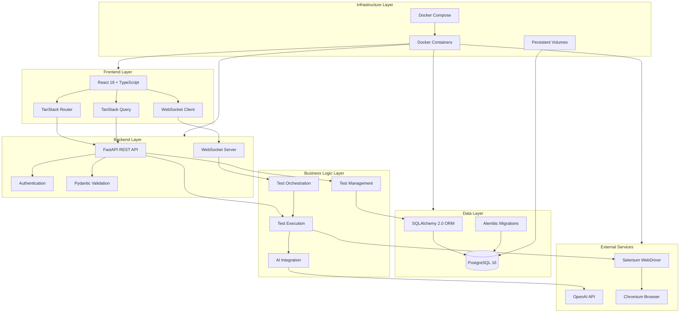
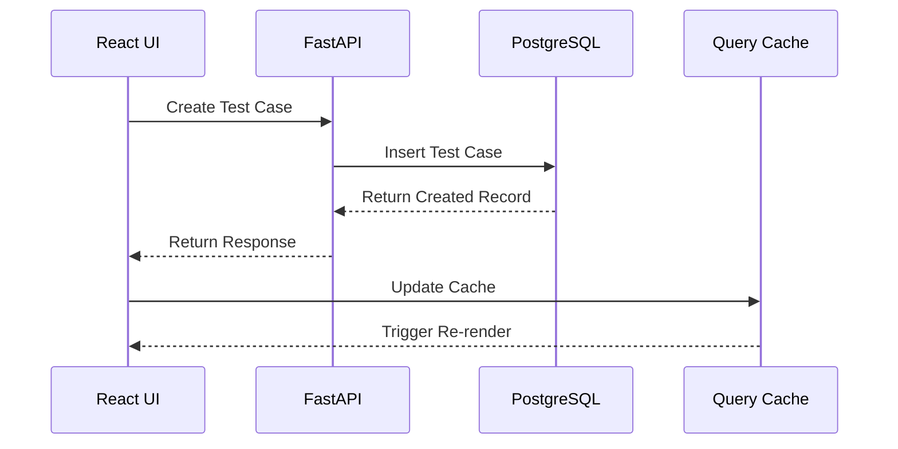
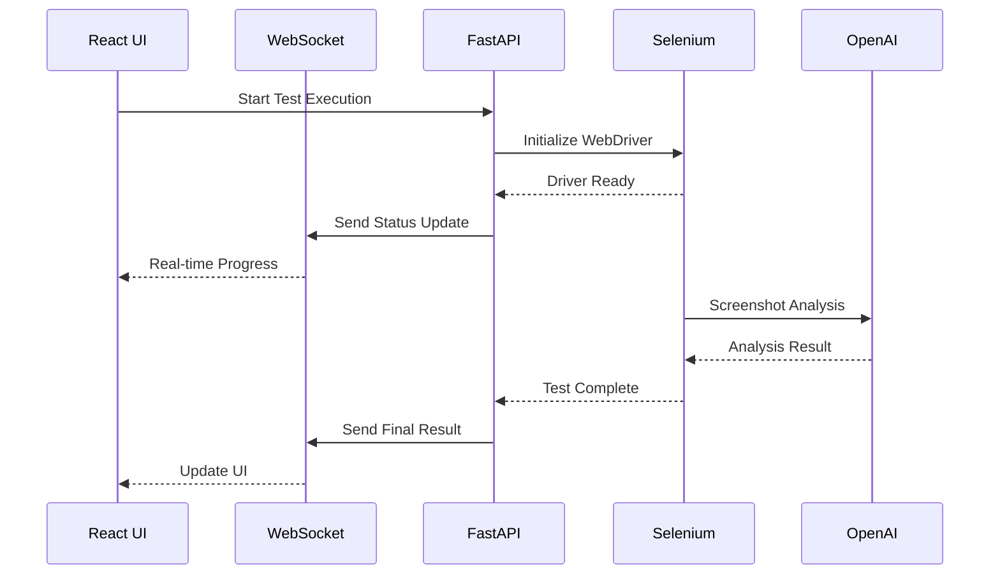

# Architecture Overview

JBTestSuite is a full-stack web automation testing platform built with modern technologies and designed for scalability, maintainability, and extensibility.

## 🏗️ System Architecture



## 🎯 Design Principles

### 1. Separation of Concerns
- **Frontend**: Pure UI/UX layer with state management
- **Backend**: API layer with business logic abstraction
- **Database**: Data persistence and integrity
- **External Services**: Isolated integrations

### 2. Scalability
- Async/await patterns throughout the backend
- Efficient database queries with SQLAlchemy 2.0
- Horizontal scaling with Docker containers
- Stateless API design for load balancing

### 3. Maintainability
- Type safety with TypeScript and Python type hints
- Comprehensive test coverage
- Clear code organization and naming conventions
- Documentation-driven development

### 4. Extensibility
- Plugin architecture for new test types
- Configurable AI providers
- Modular component system
- Event-driven architecture for real-time features

## 🏭 Component Architecture

### Frontend Architecture

```
client/src/
├── components/          # Reusable UI components
│   ├── ui/             # Base UI components
│   └── test-cases/     # Domain-specific components
├── hooks/              # Custom React hooks
├── routes/             # File-based routing pages
├── types/              # TypeScript type definitions
├── utils/              # Utility functions
└── api/                # API client layer
```

**Key Patterns:**
- **Component Composition**: Building complex UIs from simple, reusable components
- **Custom Hooks**: Abstracting stateful logic and side effects
- **Type-Safe API**: Full TypeScript coverage for API interactions
- **File-Based Routing**: Automatic route generation from file structure

### Backend Architecture

```
server/src/
├── api/                # FastAPI routers and endpoints
│   ├── v1/            # API version 1 routes
│   └── schemas/       # Pydantic request/response models
├── core/              # Core configuration and utilities
├── models/            # SQLAlchemy database models
├── services/          # Business logic layer
├── ai/                # AI integration services
└── selenium/          # Browser automation services
```

**Key Patterns:**
- **Dependency Injection**: Clean separation of concerns with FastAPI DI
- **Async/Await**: Non-blocking I/O for better performance
- **Repository Pattern**: Data access abstraction
- **Service Layer**: Business logic encapsulation

## 🔄 Data Flow

### 1. Test Case Management Flow


### 2. Test Execution Flow


## 🔌 Integration Patterns

### API Integration
- **RESTful Design**: Standard HTTP methods and status codes
- **Pagination**: Cursor-based pagination for large datasets
- **Filtering & Sorting**: Flexible query parameters
- **Bulk Operations**: Efficient batch processing

### Database Integration
- **Async Sessions**: Non-blocking database operations
- **Connection Pooling**: Efficient resource management
- **Migration Strategy**: Version-controlled schema changes
- **Relationship Loading**: Optimized eager/lazy loading

### WebSocket Integration
- **Event Broadcasting**: Real-time updates to multiple clients
- **Connection Management**: Automatic reconnection and cleanup
- **Message Queuing**: Reliable message delivery
- **Room-based Communication**: Isolated communication channels

## 🛡️ Security Architecture

### Authentication & Authorization
- JWT-based authentication
- Role-based access control (RBAC)
- API key management for external services
- Secure session management

### Data Protection
- Input validation with Pydantic
- SQL injection prevention with ORM
- XSS protection with content validation
- CORS configuration for cross-origin requests

### Infrastructure Security
- Container isolation with Docker
- Environment variable encryption
- Network segmentation
- Regular security updates

## ⚡ Performance Considerations

### Frontend Optimization
- Code splitting with dynamic imports
- Component memoization with React.memo
- Virtual scrolling for large lists
- Optimized bundle size with tree shaking

### Backend Optimization
- Database query optimization
- Response caching strategies
- Connection pooling
- Async request handling

### Infrastructure Optimization
- Container resource limits
- Volume mounting for persistent data
- Health checks for service reliability
- Load balancing capabilities

## 🚀 Deployment Architecture

### Development Environment
```
Docker Compose:
├── client:3000        # React dev server
├── server:8000        # FastAPI with hot reload
├── postgres:5432      # Database with persistent volume
└── selenium:4444      # Browser automation service
```

### Production Environment
```
Production Setup:
├── Load Balancer      # Nginx or similar
├── App Servers        # Multiple FastAPI instances
├── Database Cluster   # PostgreSQL with replication
├── Redis Cache        # Session and response caching
└── Monitoring         # Logging and metrics collection
```

## 📊 Scalability Strategy

### Horizontal Scaling
- Stateless API design enables easy horizontal scaling
- Database read replicas for improved read performance
- Container orchestration with Docker Swarm or Kubernetes
- CDN integration for static asset delivery

### Vertical Scaling
- Efficient resource utilization with async patterns
- Database connection pooling
- Memory optimization with proper data structures
- CPU optimization with background task queues

---

*This architecture is designed to grow with your testing needs while maintaining performance and reliability.*