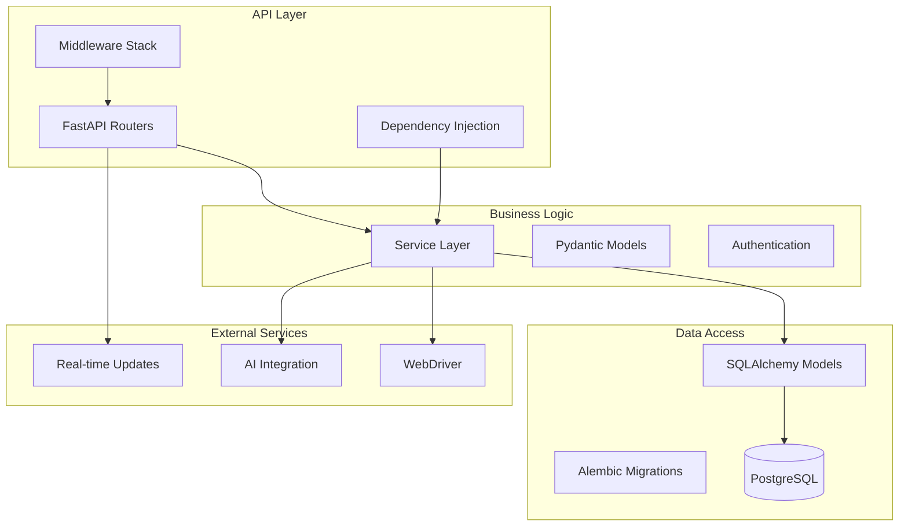

# Backend Architecture & Components

Complete documentation for the FastAPI/Python backend of JBTestSuite.

## 🏗️ Backend Architecture Overview

The backend is built using FastAPI with modern Python patterns, emphasizing async operations, type safety, and clean architecture principles.

### Technology Stack
- **FastAPI** - Modern, high-performance web framework
- **SQLAlchemy 2.0** - Async ORM with modern declarative syntax
- **Alembic** - Database migration management
- **PostgreSQL 16** - Primary database with advanced features
- **Pydantic** - Data validation and serialization
- **Python 3.11+** - Latest Python features and performance

### Architecture Patterns


## 📁 Project Structure

```
server/src/
├── api/                    # FastAPI routers and endpoints
│   ├── v1/                # API version 1 routes
│   │   ├── tests.py       # Test case endpoints
│   │   ├── executions.py  # Test execution endpoints
│   │   ├── suites.py      # Test suite endpoints
│   │   └── artifacts.py   # Artifact management
│   ├── schemas/           # Pydantic request/response models
│   │   ├── base.py        # Base schema classes
│   │   ├── test_definition.py # Test case schemas
│   │   └── test_execution.py  # Execution schemas
│   ├── health.py          # Health check endpoints
│   └── tests.py           # Legacy test routes (deprecated)
├── core/                  # Core application configuration
│   ├── config.py          # Settings and environment variables
│   ├── database.py        # Database connection and session management
│   ├── logging.py         # Logging configuration
│   └── seeder.py          # Database seeding utilities
├── models/                # SQLAlchemy database models
│   ├── base.py           # Base model classes
│   ├── test_definition.py # Test case and step models
│   ├── test_execution.py  # Execution and result models
│   ├── artifacts.py       # File and artifact models
│   └── configuration.py   # Configuration models
├── services/              # Business logic layer
│   ├── test_service.py    # Test case business logic
│   ├── execution_service.py # Test execution orchestration
│   └── artifact_service.py # File management service
├── ai/                    # AI integration services
│   ├── openai_client.py   # OpenAI API integration
│   ├── test_generator.py  # AI-powered test generation
│   └── vision_analyzer.py # Screenshot analysis
├── selenium/              # Browser automation services
│   ├── webdriver_manager.py # WebDriver lifecycle management
│   ├── page_interactions.py # Browser interaction methods
│   └── screenshot_service.py # Screenshot capture
├── cli.py                 # Command-line interface
└── main.py               # FastAPI application factory
```

## 🔌 API Layer Architecture

### FastAPI Application Factory

```python
# main.py - Application factory pattern
from fastapi import FastAPI, Depends
from fastapi.middleware.cors import CORSMiddleware
from fastapi.middleware.gzip import GZipMiddleware
from contextlib import asynccontextmanager

from src.core.config import settings
from src.core.database import create_tables
from src.api.v1 import tests, executions, suites, artifacts
from src.api.health import health_router

@asynccontextmanager
async def lifespan(app: FastAPI):
    # Startup: Create database tables
    await create_tables()
    yield
    # Shutdown: Cleanup resources

def create_app() -> FastAPI:
    app = FastAPI(
        title="JBTestSuite API",
        description="Full-stack web automation testing platform",
        version="1.0.0",
        docs_url="/docs",
        redoc_url="/redoc",
        lifespan=lifespan
    )
    
    # Middleware stack
    app.add_middleware(
        CORSMiddleware,
        allow_origins=settings.CORS_ORIGINS,
        allow_credentials=True,
        allow_methods=["*"],
        allow_headers=["*"],
    )
    app.add_middleware(GZipMiddleware, minimum_size=1000)
    
    # API routers
    app.include_router(health_router, tags=["health"])
    app.include_router(tests.router, prefix="/api/v1")
    app.include_router(executions.router, prefix="/api/v1")
    app.include_router(suites.router, prefix="/api/v1")
    app.include_router(artifacts.router, prefix="/api/v1")
    
    return app

app = create_app()
```

### Router Architecture

```python
# api/v1/tests.py - Test case router with advanced patterns
from typing import List, Optional
from uuid import UUID
from fastapi import APIRouter, Depends, HTTPException, Query, status, BackgroundTasks
from sqlalchemy.ext.asyncio import AsyncSession
from sqlalchemy import select, and_, or_, func, desc, asc
from sqlalchemy.orm import selectinload

from src.core.database import get_async_session
from src.models.test_definition import TestCase, TestStep
from src.api.schemas.test_definition import (
    TestCaseCreate, TestCaseUpdate, TestCaseResponse,
    TestCaseListResponse, PaginatedResponse, BulkOperationResponse
)
from src.services.test_service import TestService

router = APIRouter(prefix="/tests", tags=["tests"])

# Dependency injection for service layer
def get_test_service(session: AsyncSession = Depends(get_async_session)) -> TestService:
    return TestService(session)

@router.get("/", response_model=PaginatedResponse[TestCaseListResponse])
async def get_tests(
    # Query parameters with validation
    page: int = Query(1, ge=1, description="Page number"),
    limit: int = Query(20, ge=1, le=100, description="Items per page"),
    status: Optional[str] = Query(None, description="Filter by status"),
    category: Optional[str] = Query(None, description="Filter by category"),
    tags: Optional[List[str]] = Query(None, description="Filter by tags"),
    sort_by: str = Query("created_at", description="Sort field"),
    order: str = Query("desc", regex="^(asc|desc)$", description="Sort order"),
    
    # Injected dependencies
    service: TestService = Depends(get_test_service)
):
    """
    Get paginated list of test cases with filtering and sorting.
    
    - **page**: Page number (starts from 1)
    - **limit**: Number of items per page (max 100)
    - **status**: Filter by test case status
    - **category**: Filter by test case category
    - **tags**: Filter by tags (can specify multiple)
    - **sort_by**: Field to sort by
    - **order**: Sort order (asc or desc)
    """
    try:
        filters = {
            "status": status,
            "category": category,
            "tags": tags,
        }
        
        result = await service.get_paginated_tests(
            page=page,
            limit=limit,
            filters=filters,
            sort_by=sort_by,
            sort_order=order
        )
        
        return result
        
    except Exception as e:
        raise HTTPException(
            status_code=status.HTTP_500_INTERNAL_SERVER_ERROR,
            detail=f"Failed to retrieve test cases: {str(e)}"
        )

@router.post("/", response_model=TestCaseResponse, status_code=status.HTTP_201_CREATED)
async def create_test(
    test_data: TestCaseCreate,
    background_tasks: BackgroundTasks,
    service: TestService = Depends(get_test_service)
):
    """
    Create a new test case.
    
    The test case will be created with the provided data and assigned a unique ID.
    Background tasks may be triggered for indexing or notifications.
    """
    try:
        test_case = await service.create_test_case(test_data)
        
        # Background tasks for post-creation processing
        background_tasks.add_task(
            service.index_test_case_for_search,
            test_case.id
        )
        
        return test_case
        
    except ValueError as e:
        raise HTTPException(
            status_code=status.HTTP_400_BAD_REQUEST,
            detail=str(e)
        )
    except Exception as e:
        raise HTTPException(
            status_code=status.HTTP_500_INTERNAL_SERVER_ERROR,
            detail=f"Failed to create test case: {str(e)}"
        )

# Advanced endpoint with custom validation
@router.post("/bulk", response_model=BulkOperationResponse)
async def bulk_create_tests(
    tests_data: List[TestCaseCreate],
    service: TestService = Depends(get_test_service)
):
    """
    Create multiple test cases in a single operation.
    
    This endpoint supports batch creation with partial success handling.
    If some test cases fail to create, the successful ones are still persisted.
    """
    if len(tests_data) > 100:
        raise HTTPException(
            status_code=status.HTTP_400_BAD_REQUEST,
            detail="Maximum 100 test cases allowed per bulk operation"
        )
    
    result = await service.bulk_create_test_cases(tests_data)
    return result
```

### Dependency Injection System

```python
# core/dependencies.py - Advanced dependency injection
from typing import Optional
from fastapi import Depends, HTTPException, Header, status
from sqlalchemy.ext.asyncio import AsyncSession

from src.core.database import get_async_session
from src.services.auth_service import AuthService
from src.models.user import User

async def get_current_user(
    authorization: Optional[str] = Header(None),
    session: AsyncSession = Depends(get_async_session)
) -> Optional[User]:
    """Extract and validate user from authorization header."""
    if not authorization or not authorization.startswith('Bearer '):
        return None
    
    token = authorization.split(' ')[1]
    auth_service = AuthService(session)
    
    try:
        user = await auth_service.validate_token(token)
        return user
    except Exception:
        raise HTTPException(
            status_code=status.HTTP_401_UNAUTHORIZED,
            detail="Invalid authentication token",
            headers={"WWW-Authenticate": "Bearer"},
        )

def require_auth(user: User = Depends(get_current_user)) -> User:
    """Require authentication for protected endpoints."""
    if not user:
        raise HTTPException(
            status_code=status.HTTP_401_UNAUTHORIZED,
            detail="Authentication required"
        )
    return user

def require_admin(user: User = Depends(require_auth)) -> User:
    """Require admin privileges."""
    if not user.is_admin:
        raise HTTPException(
            status_code=status.HTTP_403_FORBIDDEN,
            detail="Admin privileges required"
        )
    return user
```

## 🗄️ Data Access Layer

### SQLAlchemy 2.0 Models

```python
# models/base.py - Base model with common patterns
from datetime import datetime
from uuid import UUID, uuid4
from typing import Optional

from sqlalchemy import DateTime, func, String
from sqlalchemy.orm import DeclarativeBase, Mapped, mapped_column
from sqlalchemy.dialects.postgresql import UUID as PostgresUUID

class Base(DeclarativeBase):
    """Base class for all database models."""
    pass

class TimestampedModel(Base):
    """Abstract base class with timestamp fields."""
    __abstract__ = True
    
    id: Mapped[UUID] = mapped_column(
        PostgresUUID(as_uuid=True),
        primary_key=True,
        default=uuid4,
        index=True
    )
    
    created_at: Mapped[datetime] = mapped_column(
        DateTime(timezone=True),
        server_default=func.now(),
        nullable=False,
        index=True
    )
    
    updated_at: Mapped[datetime] = mapped_column(
        DateTime(timezone=True),
        server_default=func.now(),
        onupdate=func.now(),
        nullable=False,
        index=True
    )
    
    def __repr__(self) -> str:
        return f"<{self.__class__.__name__}(id={self.id})>"
```

### Advanced Model Relationships

```python
# models/test_definition.py - Complex relationships and constraints
from enum import Enum
from typing import List, Optional
from sqlalchemy import String, Text, Boolean, Integer, JSON, ForeignKey, Index, CheckConstraint
from sqlalchemy.orm import Mapped, mapped_column, relationship

from .base import TimestampedModel

class TestCase(TimestampedModel):
    __tablename__ = "test_cases"
    
    # Basic fields with validation
    name: Mapped[str] = mapped_column(
        String(255), 
        nullable=False, 
        index=True,
        comment="Test case name (required, max 255 chars)"
    )
    
    description: Mapped[Optional[str]] = mapped_column(
        Text, 
        nullable=True,
        comment="Detailed description of test case"
    )
    
    # Enum fields with constraints
    status: Mapped[str] = mapped_column(
        String(20),
        default="draft",
        nullable=False,
        index=True
    )
    
    priority: Mapped[str] = mapped_column(
        String(20),
        default="medium", 
        nullable=False,
        index=True
    )
    
    # JSON fields for flexible data
    tags: Mapped[Optional[List[str]]] = mapped_column(
        JSON,
        nullable=True,
        default=list,
        comment="List of tags for categorization"
    )
    
    metadata: Mapped[Optional[dict]] = mapped_column(
        JSON,
        nullable=True,
        default=dict,
        comment="Additional test configuration and metadata"
    )
    
    # Performance and execution settings
    expected_duration_seconds: Mapped[Optional[int]] = mapped_column(
        Integer,
        nullable=True,
        comment="Expected test execution time in seconds"
    )
    
    retry_count: Mapped[int] = mapped_column(
        Integer,
        default=0,
        nullable=False,
        comment="Number of retry attempts on failure"
    )
    
    is_automated: Mapped[bool] = mapped_column(
        Boolean,
        default=True,
        nullable=False,
        index=True,
        comment="Whether test can be executed automatically"
    )
    
    # Relationships with cascade rules
    steps: Mapped[List["TestStep"]] = relationship(
        "TestStep",
        back_populates="test_case",
        cascade="all, delete-orphan",
        order_by="TestStep.order_index",
        lazy="selectin"  # Eager loading for performance
    )
    
    executions: Mapped[List["TestExecution"]] = relationship(
        "TestExecution",
        back_populates="test_case",
        cascade="all, delete-orphan"
    )
    
    # Composite indexes for query performance
    __table_args__ = (
        Index('ix_test_cases_status_priority', 'status', 'priority'),
        Index('ix_test_cases_category_status', 'category', 'status'),
        Index('ix_test_cases_created_at_desc', 'created_at', postgresql_using='btree'),
        
        # Constraints for data integrity
        CheckConstraint(
            "status IN ('draft', 'active', 'archived', 'deprecated')",
            name='ck_test_cases_status'
        ),
        CheckConstraint(
            "priority IN ('critical', 'high', 'medium', 'low')",
            name='ck_test_cases_priority'
        ),
        CheckConstraint(
            "retry_count >= 0 AND retry_count <= 10",
            name='ck_test_cases_retry_count'
        ),
        CheckConstraint(
            "expected_duration_seconds IS NULL OR expected_duration_seconds > 0",
            name='ck_test_cases_duration_positive'
        ),
    )
```

### Database Session Management

```python
# core/database.py - Advanced session management
from typing import AsyncGenerator
from contextlib import asynccontextmanager
from sqlalchemy.ext.asyncio import (
    AsyncSession, 
    create_async_engine, 
    async_sessionmaker,
    AsyncConnection
)
from sqlalchemy.pool import NullPool, QueuePool
from sqlalchemy.orm import DeclarativeBase

from src.core.config import settings

class Base(DeclarativeBase):
    pass

# Engine configuration with connection pooling
engine = create_async_engine(
    settings.DATABASE_URL,
    echo=settings.DEBUG,
    
    # Connection pool settings
    poolclass=QueuePool if settings.ENVIRONMENT == "production" else NullPool,
    pool_size=10,
    max_overflow=20,
    pool_pre_ping=True,
    pool_recycle=3600,  # Recycle connections every hour
    
    # Connection arguments
    connect_args={
        "server_settings": {
            "application_name": "jbtestsuite_server",
        }
    }
)

# Session factory with optimal configuration
AsyncSessionLocal = async_sessionmaker(
    engine,
    class_=AsyncSession,
    expire_on_commit=False,
    autoflush=False,  # Manual flush for better control
    autocommit=False
)

async def get_async_session() -> AsyncGenerator[AsyncSession, None]:
    """
    Dependency function to provide database sessions.
    
    Automatically handles session lifecycle:
    - Creates session
    - Yields session for use
    - Closes session on completion
    - Rolls back on exceptions
    """
    async with AsyncSessionLocal() as session:
        try:
            yield session
        except Exception:
            await session.rollback()
            raise
        finally:
            await session.close()

@asynccontextmanager
async def get_session_context() -> AsyncGenerator[AsyncSession, None]:
    """
    Context manager for manual session handling.
    Useful for service layer operations.
    """
    async with AsyncSessionLocal() as session:
        try:
            yield session
            await session.commit()
        except Exception:
            await session.rollback()
            raise

# Transaction management utilities
async def execute_in_transaction(operation, *args, **kwargs):
    """Execute operation within a database transaction."""
    async with get_session_context() as session:
        return await operation(session, *args, **kwargs)

# Database utilities
async def create_tables() -> None:
    """Create all database tables."""
    async with engine.begin() as conn:
        await conn.run_sync(Base.metadata.create_all)

async def drop_tables() -> None:
    """Drop all database tables (use with caution)."""
    async with engine.begin() as conn:
        await conn.run_sync(Base.metadata.drop_all)
```

## 🏢 Service Layer Architecture

### Business Logic Services

```python
# services/test_service.py - Business logic layer
from typing import List, Optional, Dict, Any
from uuid import UUID
from sqlalchemy.ext.asyncio import AsyncSession
from sqlalchemy import select, and_, or_, func, desc, asc
from sqlalchemy.orm import selectinload

from src.models.test_definition import TestCase, TestStep
from src.api.schemas.test_definition import (
    TestCaseCreate, TestCaseUpdate, TestCaseResponse,
    TestCaseListResponse, PaginatedResponse
)

class TestService:
    """Service class for test case business logic."""
    
    def __init__(self, session: AsyncSession):
        self.session = session
    
    async def get_paginated_tests(
        self,
        page: int = 1,
        limit: int = 20,
        filters: Optional[Dict[str, Any]] = None,
        sort_by: str = "created_at",
        sort_order: str = "desc"
    ) -> PaginatedResponse[TestCaseListResponse]:
        """
        Get paginated list of test cases with filtering and sorting.
        
        Args:
            page: Page number (1-based)
            limit: Items per page
            filters: Dictionary of filter criteria
            sort_by: Field to sort by
            sort_order: Sort order ('asc' or 'desc')
            
        Returns:
            PaginatedResponse with test cases and pagination metadata
        """
        filters = filters or {}
        
        # Build base query
        query = select(TestCase)
        
        # Apply filters
        if filters.get("status"):
            query = query.where(TestCase.status == filters["status"])
        
        if filters.get("category"):
            query = query.where(TestCase.category == filters["category"])
            
        if filters.get("author"):
            query = query.where(TestCase.author == filters["author"])
            
        if filters.get("tags"):
            for tag in filters["tags"]:
                query = query.where(TestCase.tags.contains([tag]))
        
        if filters.get("created_after"):
            query = query.where(TestCase.created_at >= filters["created_after"])
            
        if filters.get("created_before"):
            query = query.where(TestCase.created_at <= filters["created_before"])
        
        # Apply sorting
        sort_field = getattr(TestCase, sort_by, TestCase.created_at)
        if sort_order == "asc":
            query = query.order_by(asc(sort_field))
        else:
            query = query.order_by(desc(sort_field))
        
        # Count total items (before pagination)
        count_query = select(func.count()).select_from(TestCase)
        # Apply same filters to count query
        for filter_clause in query.whereclause:
            count_query = count_query.where(filter_clause)
        
        total_result = await self.session.execute(count_query)
        total = total_result.scalar()
        
        # Apply pagination
        offset = (page - 1) * limit
        query = query.offset(offset).limit(limit)
        
        # Eager load relationships
        query = query.options(selectinload(TestCase.steps))
        
        # Execute query
        result = await self.session.execute(query)
        test_cases = result.scalars().all()
        
        # Transform to response format
        items = []
        for test_case in test_cases:
            # Calculate derived fields
            step_count = len(test_case.steps) if test_case.steps else 0
            
            # TODO: Add execution statistics
            execution_count = await self._get_execution_count(test_case.id)
            last_execution_status = await self._get_last_execution_status(test_case.id)
            
            item_data = {
                "id": test_case.id,
                "name": test_case.name,
                "description": test_case.description,
                "status": test_case.status,
                "priority": test_case.priority,
                "tags": test_case.tags or [],
                "author": test_case.author,
                "category": test_case.category,
                "is_automated": test_case.is_automated,
                "step_count": step_count,
                "execution_count": execution_count,
                "last_execution_status": last_execution_status,
                "created_at": test_case.created_at,
                "updated_at": test_case.updated_at,
            }
            items.append(TestCaseListResponse(**item_data))
        
        # Calculate pagination metadata
        pages = (total + limit - 1) // limit
        
        return PaginatedResponse(
            items=items,
            total=total,
            page=page,
            limit=limit,
            pages=pages
        )
    
    async def create_test_case(self, test_data: TestCaseCreate) -> TestCaseResponse:
        """
        Create a new test case with validation.
        
        Args:
            test_data: Test case creation data
            
        Returns:
            Created test case
            
        Raises:
            ValueError: If validation fails
        """
        # Validate business rules
        await self._validate_test_case_data(test_data)
        
        # Create model instance
        test_case = TestCase(**test_data.model_dump())
        
        # Save to database
        self.session.add(test_case)
        await self.session.commit()
        await self.session.refresh(test_case)
        
        return TestCaseResponse.model_validate(test_case)
    
    async def _validate_test_case_data(self, test_data: TestCaseCreate) -> None:
        """Validate test case data according to business rules."""
        
        # Check for duplicate names in same category
        if test_data.category:
            existing = await self.session.execute(
                select(TestCase).where(
                    and_(
                        TestCase.name == test_data.name,
                        TestCase.category == test_data.category,
                        TestCase.status != "archived"
                    )
                )
            )
            if existing.scalar_one_or_none():
                raise ValueError(
                    f"Test case '{test_data.name}' already exists in category '{test_data.category}'"
                )
        
        # Validate retry count
        if test_data.retry_count < 0 or test_data.retry_count > 10:
            raise ValueError("Retry count must be between 0 and 10")
        
        # Validate expected duration
        if test_data.expected_duration_seconds is not None:
            if test_data.expected_duration_seconds <= 0:
                raise ValueError("Expected duration must be positive")
    
    async def _get_execution_count(self, test_case_id: UUID) -> int:
        """Get total execution count for a test case."""
        # TODO: Implement when TestExecution model is ready
        return 0
    
    async def _get_last_execution_status(self, test_case_id: UUID) -> Optional[str]:
        """Get status of the last execution for a test case."""
        # TODO: Implement when TestExecution model is ready
        return None
    
    async def index_test_case_for_search(self, test_case_id: UUID) -> None:
        """Background task to index test case for search."""
        # TODO: Implement search indexing
        pass
```

## 🔧 Configuration Management

### Environment-based Configuration

```python
# core/config.py - Comprehensive configuration management
from typing import List, Optional, Any, Dict
from pydantic import BaseSettings, validator, PostgresDsn
from functools import lru_cache

class Settings(BaseSettings):
    """Application settings with validation and type safety."""
    
    # Application settings
    APP_NAME: str = "JBTestSuite"
    VERSION: str = "1.0.0"
    DEBUG: bool = False
    ENVIRONMENT: str = "development"
    SECRET_KEY: str
    
    # Database settings
    DATABASE_URL: PostgresDsn
    DATABASE_POOL_SIZE: int = 10
    DATABASE_MAX_OVERFLOW: int = 20
    DATABASE_POOL_RECYCLE: int = 3600
    
    # API settings
    API_V1_PREFIX: str = "/api/v1"
    CORS_ORIGINS: List[str] = [
        "http://localhost:3000",
        "http://127.0.0.1:3000"
    ]
    
    # Security settings
    ACCESS_TOKEN_EXPIRE_MINUTES: int = 30
    REFRESH_TOKEN_EXPIRE_DAYS: int = 30
    ALGORITHM: str = "HS256"
    
    # External services
    OPENAI_API_KEY: Optional[str] = None
    SELENIUM_HUB_URL: str = "http://selenium:4444/wd/hub"
    REDIS_URL: Optional[str] = None
    
    # File storage
    UPLOAD_DIR: str = "./uploads"
    MAX_UPLOAD_SIZE: int = 10 * 1024 * 1024  # 10MB
    ALLOWED_FILE_TYPES: List[str] = [
        "image/jpeg", "image/png", "image/gif",
        "application/pdf", "text/plain"
    ]
    
    # Logging
    LOG_LEVEL: str = "INFO"
    LOG_FORMAT: str = "%(asctime)s - %(name)s - %(levelname)s - %(message)s"
    
    # Rate limiting
    RATE_LIMIT_PER_MINUTE: int = 100
    
    @validator("CORS_ORIGINS", pre=True)
    def assemble_cors_origins(cls, v: str | List[str]) -> List[str]:
        if isinstance(v, str) and not v.startswith("["):
            return [i.strip() for i in v.split(",")]
        elif isinstance(v, (list, str)):
            return v
        raise ValueError(v)
    
    @validator("DEBUG", pre=True)
    def parse_debug(cls, v: Any) -> bool:
        if isinstance(v, str):
            return v.lower() in ("true", "1", "yes", "on")
        return bool(v)
    
    @validator("DATABASE_URL", pre=True)
    def validate_database_url(cls, v: str) -> str:
        if not v.startswith(("postgresql://", "postgresql+asyncpg://")):
            raise ValueError("DATABASE_URL must be a PostgreSQL connection string")
        return v
    
    class Config:
        env_file = ".env"
        env_file_encoding = "utf-8"
        case_sensitive = True

@lru_cache()
def get_settings() -> Settings:
    """Get cached application settings."""
    return Settings()

# Global settings instance
settings = get_settings()

# Environment-specific configurations
ENVIRONMENT_CONFIGS: Dict[str, Dict[str, Any]] = {
    "development": {
        "LOG_LEVEL": "DEBUG",
        "DEBUG": True,
        "DATABASE_POOL_SIZE": 5,
    },
    "testing": {
        "LOG_LEVEL": "WARNING",
        "DEBUG": False,
        "DATABASE_URL": "sqlite+aiosqlite:///./test.db",
    },
    "staging": {
        "LOG_LEVEL": "INFO",
        "DEBUG": False,
        "RATE_LIMIT_PER_MINUTE": 200,
    },
    "production": {
        "LOG_LEVEL": "WARNING",
        "DEBUG": False,
        "DATABASE_POOL_SIZE": 20,
        "DATABASE_MAX_OVERFLOW": 40,
        "RATE_LIMIT_PER_MINUTE": 1000,
    }
}

def get_environment_config() -> Dict[str, Any]:
    """Get environment-specific configuration overrides."""
    return ENVIRONMENT_CONFIGS.get(settings.ENVIRONMENT, {})
```

## 🔒 Authentication & Security

### JWT Authentication System

```python
# services/auth_service.py - Authentication service
from datetime import datetime, timedelta
from typing import Optional
from jose import JWTError, jwt
from passlib.context import CryptContext
from sqlalchemy.ext.asyncio import AsyncSession
from sqlalchemy import select

from src.core.config import settings
from src.models.user import User
from src.api.schemas.auth import TokenData

class AuthService:
    """Service for authentication and authorization."""
    
    def __init__(self, session: AsyncSession):
        self.session = session
        self.pwd_context = CryptContext(schemes=["bcrypt"], deprecated="auto")
    
    def verify_password(self, plain_password: str, hashed_password: str) -> bool:
        """Verify a password against its hash."""
        return self.pwd_context.verify(plain_password, hashed_password)
    
    def get_password_hash(self, password: str) -> str:
        """Generate password hash."""
        return self.pwd_context.hash(password)
    
    async def authenticate_user(self, username: str, password: str) -> Optional[User]:
        """Authenticate user with username and password."""
        user = await self.get_user_by_username(username)
        if not user:
            return None
        if not self.verify_password(password, user.hashed_password):
            return None
        return user
    
    async def get_user_by_username(self, username: str) -> Optional[User]:
        """Get user by username."""
        result = await self.session.execute(
            select(User).where(User.username == username)
        )
        return result.scalar_one_or_none()
    
    def create_access_token(self, data: dict, expires_delta: Optional[timedelta] = None) -> str:
        """Create JWT access token."""
        to_encode = data.copy()
        if expires_delta:
            expire = datetime.utcnow() + expires_delta
        else:
            expire = datetime.utcnow() + timedelta(
                minutes=settings.ACCESS_TOKEN_EXPIRE_MINUTES
            )
        
        to_encode.update({"exp": expire})
        encoded_jwt = jwt.encode(
            to_encode, settings.SECRET_KEY, algorithm=settings.ALGORITHM
        )
        return encoded_jwt
    
    async def validate_token(self, token: str) -> Optional[User]:
        """Validate JWT token and return user."""
        try:
            payload = jwt.decode(
                token, settings.SECRET_KEY, algorithms=[settings.ALGORITHM]
            )
            username: str = payload.get("sub")
            if username is None:
                return None
            
            token_data = TokenData(username=username)
        except JWTError:
            return None
        
        user = await self.get_user_by_username(username=token_data.username)
        return user
```

## 📊 Error Handling & Logging

### Structured Error Handling

```python
# core/exceptions.py - Custom exception hierarchy
from typing import Optional, Dict, Any
from fastapi import HTTPException

class JBTestSuiteException(Exception):
    """Base exception for JBTestSuite."""
    
    def __init__(self, message: str, details: Optional[Dict[str, Any]] = None):
        self.message = message
        self.details = details or {}
        super().__init__(self.message)

class ValidationError(JBTestSuiteException):
    """Data validation error."""
    pass

class NotFoundError(JBTestSuiteException):
    """Resource not found error."""
    pass

class ConflictError(JBTestSuiteException):
    """Resource conflict error."""
    pass

class ExternalServiceError(JBTestSuiteException):
    """External service error."""
    pass

# Exception handlers
def create_http_exception_handler():
    """Create HTTP exception handler for FastAPI."""
    
    def exception_handler(request, exc: JBTestSuiteException):
        status_code = 500
        
        if isinstance(exc, ValidationError):
            status_code = 400
        elif isinstance(exc, NotFoundError):
            status_code = 404
        elif isinstance(exc, ConflictError):
            status_code = 409
        elif isinstance(exc, ExternalServiceError):
            status_code = 502
        
        return HTTPException(
            status_code=status_code,
            detail={
                "error": exc.__class__.__name__,
                "message": exc.message,
                "details": exc.details
            }
        )
    
    return exception_handler
```

### Comprehensive Logging

```python
# core/logging.py - Structured logging configuration
import logging
import sys
from typing import Optional
from loguru import logger
from pythonjsonlogger import jsonlogger

from src.core.config import settings

class InterceptHandler(logging.Handler):
    """Intercept standard logging and route to loguru."""
    
    def emit(self, record):
        # Get corresponding loguru level if it exists
        try:
            level = logger.level(record.levelname).name
        except ValueError:
            level = record.levelno

        # Find caller from where original logging call was made
        frame, depth = logging.currentframe(), 2
        while frame.f_code.co_filename == logging.__file__:
            frame = frame.f_back
            depth += 1

        logger.opt(depth=depth, exception=record.exc_info).log(
            level, record.getMessage()
        )

def setup_logging() -> None:
    """Setup application logging configuration."""
    
    # Remove default loguru handler
    logger.remove()
    
    # Add structured JSON logging for production
    if settings.ENVIRONMENT == "production":
        logger.add(
            sys.stdout,
            serialize=True,  # JSON format
            level=settings.LOG_LEVEL,
            format="{time:YYYY-MM-DD HH:mm:ss.SSS} | {level} | {name}:{function}:{line} | {message}",
            backtrace=True,
            diagnose=True
        )
    else:
        # Human-readable format for development
        logger.add(
            sys.stdout,
            colorize=True,
            level=settings.LOG_LEVEL,
            format="<green>{time:YYYY-MM-DD HH:mm:ss.SSS}</green> | "
                   "<level>{level: <8}</level> | "
                   "<cyan>{name}</cyan>:<cyan>{function}</cyan>:<cyan>{line}</cyan> | "
                   "<level>{message}</level>",
            backtrace=True,
            diagnose=True
        )
    
    # Intercept standard logging
    logging.root.handlers = [InterceptHandler()]
    logging.root.setLevel(settings.LOG_LEVEL)
    
    # Set levels for third-party loggers
    for name in logging.root.manager.loggerDict.keys():
        if name.startswith(("uvicorn", "sqlalchemy", "alembic")):
            logging.getLogger(name).handlers = []
            logging.getLogger(name).propagate = True

# Usage in application
def get_logger(name: str) -> logger:
    """Get logger instance for module."""
    return logger.bind(module=name)
```

---

*This backend architecture provides a robust foundation for scalable FastAPI applications with comprehensive error handling, security, and maintainability features.*