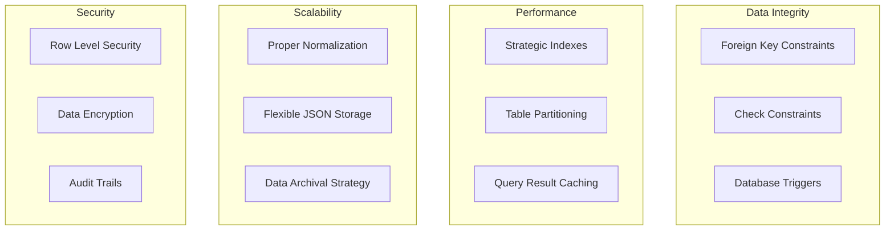

# Database Architecture & Schema

Complete documentation for the PostgreSQL database design and architecture of JBTestSuite.

## 🗄️ Database Architecture Overview

The database is built using PostgreSQL 16 with modern features, focusing on performance, data integrity, and scalability.

### Technology Stack
- **PostgreSQL 16** - Primary database with advanced features
- **SQLAlchemy 2.0** - Modern async ORM with declarative syntax
- **Alembic** - Database migration management
- **UUID** - Primary keys for better distribution and security
- **JSON/JSONB** - Flexible data storage for metadata
- **Full-Text Search** - Built-in search capabilities

### Design Principles


## 📊 Entity Relationship Diagram

```mermaid
erDiagram
    TEST_CASES ||--o{ TEST_STEPS : contains
    TEST_CASES ||--o{ TEST_EXECUTIONS : executes
    TEST_STEPS ||--o{ TEST_STEP_EXECUTIONS : executes
    TEST_CASES }o--o{ TEST_SUITES : belongs_to
    TEST_SUITES ||--o{ TEST_RUNS : executes
    TEST_RUNS ||--o{ TEST_EXECUTIONS : contains
    TEST_EXECUTIONS ||--o{ TEST_ARTIFACTS : produces
    TEST_STEP_EXECUTIONS ||--o{ TEST_ARTIFACTS : produces
    CONFIGURATIONS ||--o{ TEST_CASES : configures
    CONFIGURATIONS ||--o{ TEST_EXECUTIONS : applies_to

    TEST_CASES {
        uuid id PK
        string name
        text description
        string status
        string priority
        json tags
        json metadata
        string author
        string category
        integer expected_duration_seconds
        boolean is_automated
        integer retry_count
        timestamp created_at
        timestamp updated_at
    }

    TEST_STEPS {
        uuid id PK
        uuid test_case_id FK
        integer order_index
        string name
        text description
        string step_type
        string selector
        text input_data
        text expected_result
        json configuration
        integer timeout_seconds
        boolean is_optional
        boolean continue_on_failure
        timestamp created_at
        timestamp updated_at
    }

    TEST_SUITES {
        uuid id PK
        string name
        text description
        json tags
        json configuration
        boolean is_active
        string created_by
        timestamp created_at
        timestamp updated_at
    }

    TEST_EXECUTIONS {
        uuid id PK
        uuid test_case_id FK
        uuid test_run_id FK
        string status
        timestamp started_at
        timestamp completed_at
        integer duration_seconds
        text error_message
        json execution_metadata
        integer retry_attempt
        timestamp created_at
        timestamp updated_at
    }

    TEST_STEP_EXECUTIONS {
        uuid id PK
        uuid test_execution_id FK
        uuid test_step_id FK
        string status
        timestamp started_at
        timestamp completed_at
        integer duration_seconds
        text error_message
        text actual_result
        json step_metadata
        timestamp created_at
        timestamp updated_at
    }

    TEST_RUNS {
        uuid id PK
        uuid test_suite_id FK
        string name
        string status
        timestamp started_at
        timestamp completed_at
        integer total_tests
        integer passed_tests
        integer failed_tests
        integer skipped_tests
        json run_configuration
        string triggered_by
        timestamp created_at
        timestamp updated_at
    }

    TEST_ARTIFACTS {
        uuid id PK
        uuid test_execution_id FK
        uuid test_step_execution_id FK
        string artifact_type
        string file_name
        string file_path
        string mime_type
        integer file_size
        json metadata
        timestamp created_at
        timestamp updated_at
    }

    CONFIGURATIONS {
        uuid id PK
        string name
        text description
        string config_type
        json configuration_data
        boolean is_active
        string created_by
        timestamp created_at
        timestamp updated_at
    }
```



## 🏗️ Table Structures

### Core Test Management Tables

#### test_cases
The central table for test case definitions.

```sql
CREATE TABLE test_cases (
    id UUID PRIMARY KEY DEFAULT gen_random_uuid(),
    name VARCHAR(255) NOT NULL,
    description TEXT,
    status VARCHAR(20) NOT NULL DEFAULT 'draft',
    priority VARCHAR(20) NOT NULL DEFAULT 'medium',
    tags JSONB DEFAULT '[]'::jsonb,
    metadata JSONB DEFAULT '{}'::jsonb,
    author VARCHAR(100),
    category VARCHAR(100),
    expected_duration_seconds INTEGER,
    is_automated BOOLEAN NOT NULL DEFAULT true,
    retry_count INTEGER NOT NULL DEFAULT 0,
    created_at TIMESTAMP WITH TIME ZONE DEFAULT NOW(),
    updated_at TIMESTAMP WITH TIME ZONE DEFAULT NOW(),
    
    -- Constraints
    CONSTRAINT ck_test_cases_status 
        CHECK (status IN ('draft', 'active', 'archived', 'deprecated')),
    CONSTRAINT ck_test_cases_priority 
        CHECK (priority IN ('critical', 'high', 'medium', 'low')),
    CONSTRAINT ck_test_cases_retry_count 
        CHECK (retry_count >= 0 AND retry_count <= 10),
    CONSTRAINT ck_test_cases_duration_positive 
        CHECK (expected_duration_seconds IS NULL OR expected_duration_seconds > 0)
);

-- Indexes for performance
CREATE INDEX ix_test_cases_name ON test_cases(name);
CREATE INDEX ix_test_cases_status ON test_cases(status);
CREATE INDEX ix_test_cases_priority ON test_cases(priority);
CREATE INDEX ix_test_cases_author ON test_cases(author);
CREATE INDEX ix_test_cases_category ON test_cases(category);
CREATE INDEX ix_test_cases_is_automated ON test_cases(is_automated);
CREATE INDEX ix_test_cases_created_at ON test_cases(created_at DESC);

-- Composite indexes for common queries
CREATE INDEX ix_test_cases_status_priority ON test_cases(status, priority);
CREATE INDEX ix_test_cases_category_status ON test_cases(category, status);
CREATE INDEX ix_test_cases_author_status ON test_cases(author, status);

-- GIN index for JSON fields
CREATE INDEX ix_test_cases_tags_gin ON test_cases USING gin(tags);
CREATE INDEX ix_test_cases_metadata_gin ON test_cases USING gin(metadata);

-- Full-text search
CREATE INDEX ix_test_cases_search ON test_cases USING gin(
    to_tsvector('english', coalesce(name, '') || ' ' || coalesce(description, ''))
);
```

#### test_steps
Individual steps within test cases.

```sql
CREATE TABLE test_steps (
    id UUID PRIMARY KEY DEFAULT gen_random_uuid(),
    test_case_id UUID NOT NULL REFERENCES test_cases(id) ON DELETE CASCADE,
    order_index INTEGER NOT NULL,
    name VARCHAR(255) NOT NULL,
    description TEXT,
    step_type VARCHAR(50) NOT NULL,
    selector VARCHAR(500),
    input_data TEXT,
    expected_result TEXT,
    configuration JSONB DEFAULT '{}'::jsonb,
    timeout_seconds INTEGER DEFAULT 30,
    is_optional BOOLEAN NOT NULL DEFAULT false,
    continue_on_failure BOOLEAN NOT NULL DEFAULT false,
    created_at TIMESTAMP WITH TIME ZONE DEFAULT NOW(),
    updated_at TIMESTAMP WITH TIME ZONE DEFAULT NOW(),
    
    -- Constraints
    CONSTRAINT ck_test_steps_order_positive CHECK (order_index > 0),
    CONSTRAINT ck_test_steps_timeout_positive CHECK (timeout_seconds > 0),
    CONSTRAINT ck_test_steps_type CHECK (step_type IN (
        'navigate', 'click', 'type', 'wait', 'assert', 
        'screenshot', 'api_call', 'custom'
    )),
    
    -- Unique constraint for ordering within test case
    UNIQUE(test_case_id, order_index)
);

-- Indexes
CREATE INDEX ix_test_steps_test_case_id ON test_steps(test_case_id);
CREATE INDEX ix_test_steps_step_type ON test_steps(step_type);
CREATE INDEX ix_test_steps_case_order ON test_steps(test_case_id, order_index);
```

### Execution Tracking Tables

#### test_executions
Records of test case execution attempts.

```sql
CREATE TABLE test_executions (
    id UUID PRIMARY KEY DEFAULT gen_random_uuid(),
    test_case_id UUID NOT NULL REFERENCES test_cases(id) ON DELETE CASCADE,
    test_run_id UUID REFERENCES test_runs(id) ON DELETE SET NULL,
    status VARCHAR(20) NOT NULL DEFAULT 'pending',
    started_at TIMESTAMP WITH TIME ZONE,
    completed_at TIMESTAMP WITH TIME ZONE,
    duration_seconds INTEGER,
    error_message TEXT,
    execution_metadata JSONB DEFAULT '{}'::jsonb,
    retry_attempt INTEGER NOT NULL DEFAULT 0,
    created_at TIMESTAMP WITH TIME ZONE DEFAULT NOW(),
    updated_at TIMESTAMP WITH TIME ZONE DEFAULT NOW(),
    
    -- Constraints
    CONSTRAINT ck_test_executions_status CHECK (status IN (
        'pending', 'running', 'passed', 'failed', 'skipped', 'cancelled'
    )),
    CONSTRAINT ck_test_executions_retry_attempt CHECK (retry_attempt >= 0),
    CONSTRAINT ck_test_executions_duration_positive 
        CHECK (duration_seconds IS NULL OR duration_seconds >= 0),
    CONSTRAINT ck_test_executions_completion_logic 
        CHECK (
            (completed_at IS NULL AND status IN ('pending', 'running')) OR
            (completed_at IS NOT NULL AND status IN ('passed', 'failed', 'skipped', 'cancelled'))
        )
);

-- Indexes
CREATE INDEX ix_test_executions_test_case_id ON test_executions(test_case_id);
CREATE INDEX ix_test_executions_test_run_id ON test_executions(test_run_id);
CREATE INDEX ix_test_executions_status ON test_executions(status);
CREATE INDEX ix_test_executions_started_at ON test_executions(started_at DESC);
CREATE INDEX ix_test_executions_completed_at ON test_executions(completed_at DESC);

-- Composite indexes for analytics queries
CREATE INDEX ix_test_executions_case_status_started 
    ON test_executions(test_case_id, status, started_at DESC);
```

#### test_step_executions
Individual step execution records.

```sql
CREATE TABLE test_step_executions (
    id UUID PRIMARY KEY DEFAULT gen_random_uuid(),
    test_execution_id UUID NOT NULL REFERENCES test_executions(id) ON DELETE CASCADE,
    test_step_id UUID NOT NULL REFERENCES test_steps(id) ON DELETE CASCADE,
    status VARCHAR(20) NOT NULL DEFAULT 'pending',
    started_at TIMESTAMP WITH TIME ZONE,
    completed_at TIMESTAMP WITH TIME ZONE,
    duration_seconds INTEGER,
    error_message TEXT,
    actual_result TEXT,
    step_metadata JSONB DEFAULT '{}'::jsonb,
    created_at TIMESTAMP WITH TIME ZONE DEFAULT NOW(),
    updated_at TIMESTAMP WITH TIME ZONE DEFAULT NOW(),
    
    -- Constraints
    CONSTRAINT ck_test_step_executions_status CHECK (status IN (
        'pending', 'running', 'passed', 'failed', 'skipped'
    )),
    CONSTRAINT ck_test_step_executions_duration_positive 
        CHECK (duration_seconds IS NULL OR duration_seconds >= 0)
);

-- Indexes
CREATE INDEX ix_test_step_executions_test_execution_id 
    ON test_step_executions(test_execution_id);
CREATE INDEX ix_test_step_executions_test_step_id 
    ON test_step_executions(test_step_id);
CREATE INDEX ix_test_step_executions_status 
    ON test_step_executions(status);
```

### Organization & Configuration Tables

#### test_suites
Groupings of related test cases.

```sql
CREATE TABLE test_suites (
    id UUID PRIMARY KEY DEFAULT gen_random_uuid(),
    name VARCHAR(255) NOT NULL,
    description TEXT,
    tags JSONB DEFAULT '[]'::jsonb,
    configuration JSONB DEFAULT '{}'::jsonb,
    is_active BOOLEAN NOT NULL DEFAULT true,
    created_by VARCHAR(100),
    created_at TIMESTAMP WITH TIME ZONE DEFAULT NOW(),
    updated_at TIMESTAMP WITH TIME ZONE DEFAULT NOW()
);

-- Many-to-many relationship table
CREATE TABLE test_suite_test_cases (
    test_suite_id UUID REFERENCES test_suites(id) ON DELETE CASCADE,
    test_case_id UUID REFERENCES test_cases(id) ON DELETE CASCADE,
    order_index INTEGER,
    PRIMARY KEY (test_suite_id, test_case_id)
);

-- Indexes
CREATE INDEX ix_test_suites_name ON test_suites(name);
CREATE INDEX ix_test_suites_is_active ON test_suites(is_active);
CREATE INDEX ix_test_suites_created_by ON test_suites(created_by);
CREATE INDEX ix_test_suite_test_cases_suite_id ON test_suite_test_cases(test_suite_id);
CREATE INDEX ix_test_suite_test_cases_case_id ON test_suite_test_cases(test_case_id);
```

#### configurations
Reusable configuration templates.

```sql
CREATE TABLE configurations (
    id UUID PRIMARY KEY DEFAULT gen_random_uuid(),
    name VARCHAR(255) NOT NULL,
    description TEXT,
    config_type VARCHAR(50) NOT NULL,
    configuration_data JSONB NOT NULL DEFAULT '{}'::jsonb,
    is_active BOOLEAN NOT NULL DEFAULT true,
    created_by VARCHAR(100),
    created_at TIMESTAMP WITH TIME ZONE DEFAULT NOW(),
    updated_at TIMESTAMP WITH TIME ZONE DEFAULT NOW(),
    
    -- Constraints
    CONSTRAINT ck_configurations_type CHECK (config_type IN (
        'browser', 'environment', 'execution', 'notification', 'integration'
    )),
    
    -- Unique constraint for active configurations of same type
    UNIQUE(name, config_type) WHERE is_active = true
);

-- Indexes
CREATE INDEX ix_configurations_name ON configurations(name);
CREATE INDEX ix_configurations_type ON configurations(config_type);
CREATE INDEX ix_configurations_is_active ON configurations(is_active);
CREATE INDEX ix_configurations_created_by ON configurations(created_by);
```

## 🚀 Database Performance Optimizations

### Strategic Indexing

#### Primary Query Patterns
```sql
-- Test case listing with filtering
EXPLAIN ANALYZE 
SELECT * FROM test_cases 
WHERE status = 'active' 
  AND category = 'authentication' 
ORDER BY created_at DESC 
LIMIT 20;

-- Test execution history
EXPLAIN ANALYZE
SELECT te.*, tc.name 
FROM test_executions te
JOIN test_cases tc ON tc.id = te.test_case_id
WHERE te.test_case_id = $1
ORDER BY te.started_at DESC
LIMIT 10;

-- Search functionality
EXPLAIN ANALYZE
SELECT * FROM test_cases
WHERE to_tsvector('english', name || ' ' || coalesce(description, '')) 
    @@ plainto_tsquery('english', $1);
```

#### JSON Query Optimization
```sql
-- Optimized JSON queries with GIN indexes
SELECT * FROM test_cases 
WHERE tags @> '["critical"]'::jsonb;

SELECT * FROM test_cases 
WHERE metadata @> '{"browser": "chrome"}'::jsonb;

-- JSON path queries
SELECT * FROM test_cases 
WHERE metadata #> '{environment,name}' = '"staging"';
```

### Partitioning Strategy

#### Time-based Partitioning for Executions
```sql
-- Partition test_executions by month for better performance
CREATE TABLE test_executions_2025_01 PARTITION OF test_executions
    FOR VALUES FROM ('2025-01-01') TO ('2025-02-01');

CREATE TABLE test_executions_2025_02 PARTITION OF test_executions
    FOR VALUES FROM ('2025-02-01') TO ('2025-03-01');

-- Automatic partition creation function
CREATE OR REPLACE FUNCTION create_monthly_partition(table_name TEXT, start_date DATE)
RETURNS VOID AS $$
DECLARE
    partition_name TEXT;
    end_date DATE;
BEGIN
    partition_name := table_name || '_' || to_char(start_date, 'YYYY_MM');
    end_date := start_date + INTERVAL '1 month';
    
    EXECUTE format('CREATE TABLE %I PARTITION OF %I
                    FOR VALUES FROM (%L) TO (%L)',
                    partition_name, table_name, start_date, end_date);
END;
$$ LANGUAGE plpgsql;
```

### Query Result Caching

#### Materialized Views for Analytics
```sql
-- Test case statistics materialized view
CREATE MATERIALIZED VIEW test_case_stats AS
SELECT 
    tc.id,
    tc.name,
    tc.category,
    tc.priority,
    COUNT(te.id) as total_executions,
    COUNT(CASE WHEN te.status = 'passed' THEN 1 END) as passed_executions,
    COUNT(CASE WHEN te.status = 'failed' THEN 1 END) as failed_executions,
    AVG(te.duration_seconds) as avg_duration,
    MAX(te.completed_at) as last_executed_at,
    CASE 
        WHEN COUNT(te.id) = 0 THEN 'never_executed'
        WHEN COUNT(CASE WHEN te.status = 'failed' THEN 1 END) = 0 THEN 'stable'
        WHEN COUNT(CASE WHEN te.status = 'failed' THEN 1 END)::float / COUNT(te.id) > 0.5 THEN 'unstable'
        ELSE 'moderate'
    END as stability_rating
FROM test_cases tc
LEFT JOIN test_executions te ON tc.id = te.test_case_id
GROUP BY tc.id, tc.name, tc.category, tc.priority;

-- Refresh strategy
CREATE UNIQUE INDEX ON test_case_stats (id);

-- Auto-refresh trigger
CREATE OR REPLACE FUNCTION refresh_test_case_stats()
RETURNS TRIGGER AS $$
BEGIN
    REFRESH MATERIALIZED VIEW CONCURRENTLY test_case_stats;
    RETURN NULL;
END;
$$ LANGUAGE plpgsql;

CREATE TRIGGER trigger_refresh_test_case_stats
    AFTER INSERT OR UPDATE OR DELETE ON test_executions
    FOR EACH STATEMENT EXECUTE FUNCTION refresh_test_case_stats();
```

## 🔒 Security & Data Integrity

### Row-Level Security (RLS)

#### User-based Access Control
```sql
-- Enable RLS on sensitive tables
ALTER TABLE test_cases ENABLE ROW LEVEL SECURITY;
ALTER TABLE test_executions ENABLE ROW LEVEL SECURITY;

-- Policy for test case access
CREATE POLICY test_case_access_policy ON test_cases
    FOR ALL TO application_users
    USING (
        author = current_setting('app.user_id', true) OR
        'admin' = ANY(string_to_array(current_setting('app.user_roles', true), ','))
    );

-- Policy for execution access
CREATE POLICY test_execution_access_policy ON test_executions
    FOR ALL TO application_users
    USING (
        EXISTS (
            SELECT 1 FROM test_cases tc 
            WHERE tc.id = test_case_id 
            AND (tc.author = current_setting('app.user_id', true) OR
                 'admin' = ANY(string_to_array(current_setting('app.user_roles', true), ',')))
        )
    );
```

### Data Validation Triggers

#### Comprehensive Data Validation
```sql
-- Test case validation trigger
CREATE OR REPLACE FUNCTION validate_test_case()
RETURNS TRIGGER AS $$
BEGIN
    -- Validate name uniqueness within category
    IF EXISTS (
        SELECT 1 FROM test_cases 
        WHERE name = NEW.name 
        AND category = NEW.category 
        AND id != NEW.id
        AND status != 'archived'
    ) THEN
        RAISE EXCEPTION 'Test case name must be unique within category';
    END IF;
    
    -- Validate tags format
    IF NEW.tags IS NOT NULL AND NOT jsonb_typeof(NEW.tags) = 'array' THEN
        RAISE EXCEPTION 'Tags must be an array';
    END IF;
    
    -- Set updated timestamp
    NEW.updated_at = NOW();
    
    RETURN NEW;
END;
$$ LANGUAGE plpgsql;

CREATE TRIGGER trigger_validate_test_case
    BEFORE INSERT OR UPDATE ON test_cases
    FOR EACH ROW EXECUTE FUNCTION validate_test_case();
```

### Audit Trail

#### Complete Audit Logging
```sql
-- Audit table for tracking changes
CREATE TABLE audit_log (
    id UUID PRIMARY KEY DEFAULT gen_random_uuid(),
    table_name VARCHAR(100) NOT NULL,
    record_id UUID NOT NULL,
    operation VARCHAR(10) NOT NULL,
    old_values JSONB,
    new_values JSONB,
    changed_by VARCHAR(100),
    changed_at TIMESTAMP WITH TIME ZONE DEFAULT NOW()
);

-- Generic audit trigger function
CREATE OR REPLACE FUNCTION audit_trigger()
RETURNS TRIGGER AS $$
BEGIN
    IF TG_OP = 'DELETE' THEN
        INSERT INTO audit_log(table_name, record_id, operation, old_values, changed_by)
        VALUES (TG_TABLE_NAME, OLD.id, 'DELETE', row_to_json(OLD), 
                current_setting('app.user_id', true));
        RETURN OLD;
    END IF;
    
    IF TG_OP = 'UPDATE' THEN
        INSERT INTO audit_log(table_name, record_id, operation, old_values, new_values, changed_by)
        VALUES (TG_TABLE_NAME, NEW.id, 'UPDATE', row_to_json(OLD), row_to_json(NEW),
                current_setting('app.user_id', true));
        RETURN NEW;
    END IF;
    
    IF TG_OP = 'INSERT' THEN
        INSERT INTO audit_log(table_name, record_id, operation, new_values, changed_by)
        VALUES (TG_TABLE_NAME, NEW.id, 'INSERT', row_to_json(NEW),
                current_setting('app.user_id', true));
        RETURN NEW;
    END IF;
    
    RETURN NULL;
END;
$$ LANGUAGE plpgsql;

-- Apply audit triggers to tables
CREATE TRIGGER test_cases_audit_trigger
    AFTER INSERT OR UPDATE OR DELETE ON test_cases
    FOR EACH ROW EXECUTE FUNCTION audit_trigger();

CREATE TRIGGER test_executions_audit_trigger
    AFTER INSERT OR UPDATE OR DELETE ON test_executions
    FOR EACH ROW EXECUTE FUNCTION audit_trigger();
```

## 📊 Analytics & Reporting Views

### Performance Metrics Views

#### Test Execution Analytics
```sql
-- Comprehensive execution metrics view
CREATE VIEW test_execution_metrics AS
SELECT 
    tc.id as test_case_id,
    tc.name,
    tc.category,
    tc.priority,
    COUNT(te.id) as total_executions,
    COUNT(CASE WHEN te.status = 'passed' THEN 1 END) as passed_count,
    COUNT(CASE WHEN te.status = 'failed' THEN 1 END) as failed_count,
    COUNT(CASE WHEN te.status = 'skipped' THEN 1 END) as skipped_count,
    
    -- Success rate calculation
    ROUND(
        COUNT(CASE WHEN te.status = 'passed' THEN 1 END)::numeric / 
        NULLIF(COUNT(CASE WHEN te.status IN ('passed', 'failed') THEN 1 END), 0) * 100, 
        2
    ) as success_rate_percent,
    
    -- Performance metrics
    AVG(te.duration_seconds) as avg_duration,
    MIN(te.duration_seconds) as min_duration,
    MAX(te.duration_seconds) as max_duration,
    PERCENTILE_CONT(0.5) WITHIN GROUP (ORDER BY te.duration_seconds) as median_duration,
    
    -- Temporal analysis
    MAX(te.completed_at) as last_executed_at,
    MIN(te.completed_at) as first_executed_at,
    
    -- Trend analysis (last 30 days vs previous 30 days)
    COUNT(CASE 
        WHEN te.started_at >= CURRENT_DATE - INTERVAL '30 days' 
        THEN 1 
    END) as executions_last_30_days,
    
    COUNT(CASE 
        WHEN te.started_at >= CURRENT_DATE - INTERVAL '60 days' 
        AND te.started_at < CURRENT_DATE - INTERVAL '30 days'
        THEN 1 
    END) as executions_previous_30_days

FROM test_cases tc
LEFT JOIN test_executions te ON tc.id = te.test_case_id
GROUP BY tc.id, tc.name, tc.category, tc.priority;
```

#### Failure Analysis View
```sql
-- Detailed failure analysis
CREATE VIEW test_failure_analysis AS
SELECT 
    tc.name as test_name,
    tc.category,
    te.error_message,
    COUNT(*) as failure_count,
    MAX(te.completed_at) as last_failure_at,
    
    -- Step-level failure analysis
    (
        SELECT jsonb_agg(
            jsonb_build_object(
                'step_name', ts.name,
                'step_type', ts.step_type,
                'failure_count', step_failures.count,
                'common_errors', step_failures.errors
            )
        )
        FROM (
            SELECT 
                tse.test_step_id,
                COUNT(*) as count,
                array_agg(DISTINCT tse.error_message) as errors
            FROM test_step_executions tse
            WHERE tse.test_execution_id IN (
                SELECT id FROM test_executions 
                WHERE test_case_id = tc.id AND status = 'failed'
            )
            AND tse.status = 'failed'
            GROUP BY tse.test_step_id
        ) step_failures
        JOIN test_steps ts ON ts.id = step_failures.test_step_id
    ) as failing_steps

FROM test_cases tc
JOIN test_executions te ON tc.id = te.test_case_id
WHERE te.status = 'failed'
GROUP BY tc.id, tc.name, tc.category, te.error_message;
```

## 🔄 Data Management Procedures

### Data Archival Strategy

#### Automated Data Archival
```sql
-- Archive old execution data
CREATE OR REPLACE FUNCTION archive_old_executions(retention_days INTEGER DEFAULT 90)
RETURNS INTEGER AS $$
DECLARE
    archived_count INTEGER;
    cutoff_date TIMESTAMP WITH TIME ZONE;
BEGIN
    cutoff_date := CURRENT_TIMESTAMP - (retention_days || ' days')::INTERVAL;
    
    -- Create archive table if not exists
    CREATE TABLE IF NOT EXISTS test_executions_archive (
        LIKE test_executions INCLUDING ALL
    );
    
    -- Move old records to archive
    WITH archived_records AS (
        DELETE FROM test_executions 
        WHERE completed_at < cutoff_date 
        AND status IN ('passed', 'failed', 'skipped')
        RETURNING *
    )
    INSERT INTO test_executions_archive 
    SELECT * FROM archived_records;
    
    GET DIAGNOSTICS archived_count = ROW_COUNT;
    
    -- Log archival operation
    INSERT INTO audit_log(table_name, record_id, operation, new_values, changed_by)
    VALUES ('test_executions', gen_random_uuid(), 'ARCHIVE', 
            jsonb_build_object('archived_count', archived_count, 'cutoff_date', cutoff_date),
            'system');
    
    RETURN archived_count;
END;
$$ LANGUAGE plpgsql;

-- Schedule archival job (example for pg_cron extension)
-- SELECT cron.schedule('archive-executions', '0 2 * * *', 'SELECT archive_old_executions(90);');
```

### Database Maintenance

#### Statistics and Maintenance Tasks
```sql
-- Update table statistics
CREATE OR REPLACE FUNCTION update_table_statistics()
RETURNS VOID AS $$
BEGIN
    ANALYZE test_cases;
    ANALYZE test_steps;
    ANALYZE test_executions;
    ANALYZE test_step_executions;
    ANALYZE test_suites;
    ANALYZE configurations;
    
    -- Refresh materialized views
    REFRESH MATERIALIZED VIEW CONCURRENTLY test_case_stats;
    
    -- Log maintenance completion
    INSERT INTO audit_log(table_name, record_id, operation, new_values, changed_by)
    VALUES ('maintenance', gen_random_uuid(), 'ANALYZE', 
            jsonb_build_object('timestamp', CURRENT_TIMESTAMP),
            'system');
END;
$$ LANGUAGE plpgsql;

-- Vacuum and reindex strategy
CREATE OR REPLACE FUNCTION database_maintenance()
RETURNS VOID AS $$
BEGIN
    -- Vacuum analyze tables
    VACUUM ANALYZE test_cases;
    VACUUM ANALYZE test_executions;
    
    -- Reindex if needed (check for bloat)
    REINDEX INDEX CONCURRENTLY ix_test_cases_name;
    REINDEX INDEX CONCURRENTLY ix_test_executions_test_case_id;
    
    -- Update statistics
    PERFORM update_table_statistics();
END;
$$ LANGUAGE plpgsql;
```

---

*This database architecture provides a robust foundation for scalable test management with comprehensive performance optimization, security, and data integrity features.*