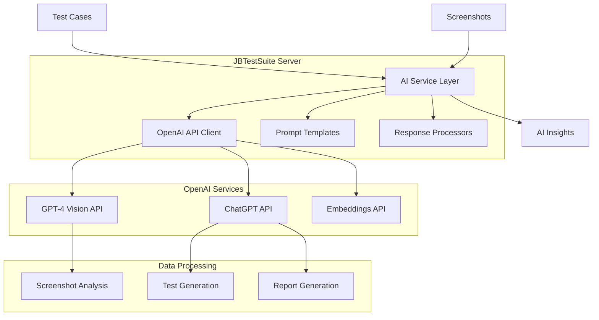

# AI Integration

JBTestSuite leverages OpenAI's powerful AI models to provide intelligent test automation, generation, and analysis capabilities.

## Overview

The platform integrates with OpenAI's API to provide:
- **Test Case Generation**: AI-powered creation of comprehensive test scenarios
- **Visual Analysis**: Screenshot analysis using GPT-4 Vision
- **Intelligent Insights**: Pattern recognition and test optimization recommendations
- **Natural Language Processing**: Convert requirements to executable tests

## Architecture



## Core Features

### Test Case Generation

#### Natural Language to Test Cases
Convert plain English requirements into structured test cases:

```python
POST /api/ai/generate-tests
Content-Type: application/json

{
    "description": "Test user login functionality with valid and invalid credentials",
    "application_type": "web",
    "target_url": "https://app.example.com/login",
    "requirements": [
        "Users can login with valid email/password",
        "Invalid credentials show error message",
        "Password field is masked",
        "Remember me checkbox works"
    ]
}
```

#### Smart Test Scenarios
AI suggests comprehensive test scenarios including:
- **Happy Path Tests**: Standard user workflows
- **Edge Cases**: Boundary conditions and unusual inputs
- **Error Scenarios**: Invalid data and system failures
- **Security Tests**: Authentication and authorization checks

### Visual Analysis

#### Screenshot Analysis
GPT-4 Vision analyzes screenshots to:
- Identify UI elements and their states
- Detect visual anomalies and inconsistencies
- Compare against expected designs
- Generate accessibility insights

```python
POST /api/ai/analyze-screenshot
Content-Type: multipart/form-data

{
    "screenshot": <image_file>,
    "analysis_type": "ui_validation",
    "context": "Login page after form submission",
    "expected_elements": ["error_message", "login_form", "submit_button"]
}
```

#### Visual Regression Detection
- **Baseline Comparison**: Compare current screenshots with approved baselines
- **Layout Analysis**: Detect shifts, overlaps, and alignment issues
- **Color and Style Verification**: Ensure consistent visual presentation
- **Responsive Design Validation**: Check layouts across different viewport sizes

### Intelligent Test Maintenance

#### Adaptive Selectors
AI helps maintain robust test automation:
- **Selector Optimization**: Suggest more stable element selectors
- **Fallback Strategies**: Provide alternative selectors when primary ones fail
- **Dynamic Content Handling**: Adapt to changing page structures

#### Test Result Analysis
- **Failure Pattern Recognition**: Identify common failure causes
- **Flaky Test Detection**: Recognize and flag unreliable tests
- **Performance Insights**: Analyze execution times and resource usage

## Configuration

### Environment Variables

```bash
# OpenAI Configuration
OPENAI_API_KEY=sk-your-api-key
OPENAI_MODEL=gpt-4
OPENAI_VISION_MODEL=gpt-4-vision-preview
OPENAI_MAX_TOKENS=4096
OPENAI_TEMPERATURE=0.3

# Feature Flags
AI_TEST_GENERATION_ENABLED=true
AI_VISUAL_ANALYSIS_ENABLED=true
AI_INSIGHTS_ENABLED=true
```

### Model Configuration

```python
# AI Service Configuration
AI_CONFIG = {
    "models": {
        "text_generation": "gpt-4",
        "vision_analysis": "gpt-4-vision-preview",
        "embeddings": "text-embedding-ada-002"
    },
    "parameters": {
        "temperature": 0.3,
        "max_tokens": 4096,
        "top_p": 0.9
    }
}
```

## API Integration

### Test Generation Endpoints

```python
# Generate test cases from description
POST /api/ai/generate-tests
{
    "description": "User registration flow",
    "requirements": ["email validation", "password strength"],
    "test_types": ["positive", "negative", "boundary"]
}

# Generate test steps from high-level scenario
POST /api/ai/generate-steps
{
    "scenario": "User logs in successfully",
    "page_elements": ["email_field", "password_field", "login_button"]
}

# Enhance existing test case
POST /api/ai/enhance-test/{test_id}
{
    "enhancements": ["add_assertions", "improve_selectors", "add_edge_cases"]
}
```

### Visual Analysis Endpoints

```python
# Analyze single screenshot
POST /api/ai/analyze-screenshot
{
    "image_data": "base64_encoded_image",
    "analysis_type": "accessibility",
    "context": "Product listing page"
}

# Compare two screenshots
POST /api/ai/compare-screenshots
{
    "baseline_image": "base64_encoded_image",
    "current_image": "base64_encoded_image",
    "comparison_type": "layout_diff"
}

# Generate accessibility report
POST /api/ai/accessibility-analysis
{
    "screenshot_id": "uuid",
    "wcag_level": "AA"
}
```

### Insight Generation

```python
# Analyze test execution patterns
GET /api/ai/insights/execution-patterns?days=30

# Get test optimization recommendations
GET /api/ai/insights/optimization-suggestions/{test_id}

# Generate test coverage analysis
POST /api/ai/insights/coverage-analysis
{
    "application_url": "https://app.example.com",
    "test_suite_id": "uuid"
}
```

## Prompt Templates

### Test Generation Templates

```python
GENERATE_TEST_CASES_PROMPT = """
Given the following application description and requirements, generate comprehensive test cases:

Application: {application_description}
Target URL: {target_url}
Requirements: {requirements}

For each test case, provide:
1. Test case name
2. Objective
3. Preconditions
4. Test steps
5. Expected results
6. Priority level
7. Category

Focus on creating realistic, executable test scenarios that cover both positive and negative cases.
"""

ENHANCE_SELECTORS_PROMPT = """
Analyze the following web page HTML and suggest robust CSS selectors for test automation:

HTML: {page_html}
Current selectors: {current_selectors}

Provide:
1. More stable selector alternatives
2. Fallback options for each selector
3. Reasoning for selector choices
4. Accessibility-friendly selectors where possible
"""
```

### Visual Analysis Templates

```python
ANALYZE_SCREENSHOT_PROMPT = """
Analyze this screenshot for UI/UX issues and provide insights:

Image: [Screenshot attached]
Context: {context}
Focus areas: {focus_areas}

Please analyze:
1. Visual layout and alignment
2. Color contrast and accessibility
3. Missing or broken elements
4. User experience issues
5. Responsive design considerations

Provide specific, actionable feedback.
"""

COMPARE_SCREENSHOTS_PROMPT = """
Compare these two screenshots and identify differences:

Baseline: [Image 1]
Current: [Image 2]
Context: {context}

Identify:
1. Layout differences
2. Color/style changes  
3. Missing or new elements
4. Text changes
5. Overall visual impact assessment
"""
```

## Best Practices

### Prompt Engineering

1. **Context Provision**
   - Include relevant application context
   - Provide clear objectives and constraints
   - Specify desired output format

2. **Iterative Refinement**
   - Use feedback loops to improve prompts
   - A/B test different prompt variations
   - Monitor output quality metrics

### API Usage Optimization

1. **Token Management**
   - Monitor API usage and costs
   - Implement response caching where appropriate
   - Use appropriate model sizes for different tasks

2. **Error Handling**
   - Implement retry logic with exponential backoff
   - Handle rate limiting gracefully
   - Provide fallback options when AI services are unavailable

### Quality Assurance

1. **Output Validation**
   - Validate AI-generated test cases before execution
   - Implement confidence scoring for recommendations
   - Allow human oversight and approval workflows

2. **Continuous Improvement**
   - Collect feedback on AI-generated content
   - Monitor test success rates from AI-generated cases
   - Regularly update prompts based on results

## Monitoring and Analytics

### Usage Metrics

```python
# API usage tracking
{
    "requests_per_hour": 150,
    "tokens_consumed": 45000,
    "average_response_time": "2.3s",
    "success_rate": 0.98
}

# Feature adoption
{
    "test_generation_usage": 0.75,
    "visual_analysis_usage": 0.45,
    "insights_requests": 0.30
}
```

### Quality Metrics

```python
# AI-generated test effectiveness
{
    "tests_generated": 234,
    "tests_executed_successfully": 198,
    "bugs_found_by_ai_tests": 12,
    "false_positive_rate": 0.08
}

# Visual analysis accuracy
{
    "screenshots_analyzed": 445,
    "accurate_identifications": 423,
    "accuracy_rate": 0.95
}
```

## Integration Examples

### Test Generation Workflow

```python
async def generate_and_create_tests(requirements: TestRequirements):
    # Generate test cases using AI
    ai_response = await ai_service.generate_tests(
        description=requirements.description,
        target_url=requirements.url,
        requirements=requirements.criteria
    )
    
    # Process and validate AI response
    test_cases = process_ai_test_cases(ai_response)
    
    # Create test cases in database
    created_tests = []
    for test_case in test_cases:
        validated_test = await validate_test_case(test_case)
        created_test = await test_service.create_test_case(validated_test)
        created_tests.append(created_test)
    
    return created_tests
```

### Visual Analysis Integration

```python
async def analyze_test_screenshot(test_run_id: str, screenshot_path: str):
    # Load screenshot
    screenshot_data = await load_screenshot(screenshot_path)
    
    # Analyze with AI
    analysis = await ai_service.analyze_screenshot(
        image_data=screenshot_data,
        analysis_type="ui_validation",
        context=f"Test run {test_run_id}"
    )
    
    # Store analysis results
    await analysis_service.store_analysis(
        test_run_id=test_run_id,
        analysis_data=analysis,
        screenshot_path=screenshot_path
    )
    
    # Generate alerts for issues
    if analysis.issues_found:
        await alert_service.create_visual_issue_alert(test_run_id, analysis)
```

## Limitations and Considerations

### Current Limitations

1. **API Dependencies**
   - Requires internet connection for OpenAI API access
   - Subject to OpenAI rate limits and availability
   - Costs associated with API usage

2. **Output Variability**
   - AI responses may vary between requests
   - Requires validation and human oversight
   - May need refinement for specific use cases

### Future Enhancements

1. **Local AI Models**
   - Support for locally hosted models
   - Reduced dependency on external services
   - Enhanced privacy and security

2. **Specialized Models**
   - Fine-tuned models for testing domain
   - Custom embeddings for application-specific knowledge
   - Enhanced accuracy for specific use cases

---

*For more information about OpenAI API usage, see the [OpenAI Documentation](https://platform.openai.com/docs). For implementation details, see the [API Documentation](../api/README.md).*