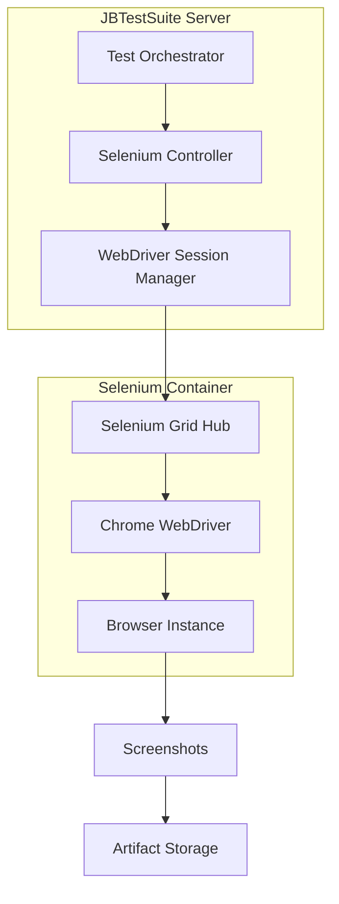

# Selenium Integration

JBTestSuite provides comprehensive browser automation capabilities through Selenium WebDriver integration.

## Overview

The platform uses Selenium with Chromium browser running in a containerized environment, providing consistent and reliable browser automation across different environments.

## Architecture



## Core Features

### Browser Management

- **Session Lifecycle**: Automatic browser session creation and cleanup
- **Resource Management**: Efficient WebDriver resource allocation
- **Parallel Execution**: Support for concurrent browser sessions
- **Error Recovery**: Automatic recovery from browser crashes

### Element Interaction

- **Smart Selectors**: CSS and XPath selector support with fallback strategies
- **Wait Strategies**: Intelligent waiting for elements and page loads
- **Action Chains**: Complex user interaction sequences
- **Form Handling**: Automated form filling and submission

### Screenshot Capabilities

- **Full Page Screenshots**: Complete page capture including scrollable content
- **Element Screenshots**: Targeted element capture for focused testing
- **Comparison Testing**: Visual diff capabilities for UI regression testing
- **Annotation Support**: Markup and highlighting for test documentation

## Configuration

### Environment Variables

```bash
# Selenium Grid Configuration
SELENIUM_HUB_URL=http://selenium:4444/wd/hub

# Browser Settings
BROWSER_IMPLICIT_WAIT=10
BROWSER_PAGE_LOAD_TIMEOUT=30
BROWSER_SCRIPT_TIMEOUT=30

# Screenshot Settings  
SCREENSHOT_FORMAT=PNG
SCREENSHOT_QUALITY=90
```

### WebDriver Options

```python
# Chrome Options Configuration
chrome_options = webdriver.ChromeOptions()
chrome_options.add_argument("--headless")
chrome_options.add_argument("--no-sandbox")
chrome_options.add_argument("--disable-dev-shm-usage")
chrome_options.add_argument("--window-size=1920,1080")
```

## API Integration

### Starting Browser Sessions

```python
POST /api/selenium/session
Content-Type: application/json

{
    "browser": "chrome",
    "headless": true,
    "window_size": {"width": 1920, "height": 1080}
}
```

### Navigation Commands

```python
# Navigate to URL
POST /api/selenium/{session_id}/navigate
{
    "url": "https://example.com"
}

# Get current URL
GET /api/selenium/{session_id}/url

# Go back/forward
POST /api/selenium/{session_id}/back
POST /api/selenium/{session_id}/forward
```

### Element Operations

```python
# Find elements
POST /api/selenium/{session_id}/elements
{
    "selector": "#submit-button",
    "method": "css_selector"
}

# Click element
POST /api/selenium/{session_id}/click
{
    "element_id": "element-uuid"
}

# Send keys
POST /api/selenium/{session_id}/keys
{
    "element_id": "element-uuid",
    "text": "Hello World"
}
```

### Screenshot Capture

```python
# Full page screenshot
GET /api/selenium/{session_id}/screenshot

# Element screenshot  
GET /api/selenium/{session_id}/screenshot/{element_id}

# Save to artifacts
POST /api/selenium/{session_id}/screenshot/save
{
    "filename": "login-page.png",
    "description": "Login page after form submission"
}
```

## Best Practices

### Session Management

1. **Resource Cleanup**
   - Always close browser sessions after test completion
   - Use try/finally blocks for guaranteed cleanup
   - Monitor session limits to prevent resource exhaustion

2. **Session Reuse**
   - Reuse sessions for related test steps
   - Avoid creating new sessions for each action
   - Balance session reuse with test isolation

### Element Selection

1. **Robust Selectors**
   - Prefer stable CSS selectors over XPath when possible
   - Use data attributes for test-specific element identification
   - Implement fallback selector strategies

2. **Wait Strategies**
   - Use explicit waits over implicit waits
   - Wait for specific conditions, not arbitrary timeouts
   - Implement custom wait conditions for complex scenarios

### Error Handling

1. **Graceful Degradation**
   - Handle element not found scenarios gracefully
   - Provide meaningful error messages
   - Implement retry logic for transient failures

2. **Debugging Support**
   - Capture screenshots on test failures
   - Log detailed error information
   - Preserve browser state for post-mortem analysis

## Troubleshooting

### Common Issues

1. **Session Creation Failures**
   - Check Selenium Grid availability
   - Verify container networking configuration
   - Review resource limits and availability

2. **Element Not Found Errors**
   - Verify selector accuracy and uniqueness
   - Check for timing issues with dynamic content
   - Ensure page load completion before element interaction

3. **Screenshot Issues**
   - Verify browser viewport size configuration
   - Check file system permissions for artifact storage
   - Monitor disk space for screenshot storage

### Performance Optimization

1. **Browser Configuration**
   - Use headless mode for faster execution
   - Disable images and CSS for content-only testing
   - Configure appropriate timeout values

2. **Resource Management**
   - Limit concurrent browser sessions
   - Monitor memory usage and implement limits
   - Use browser recycling for long-running tests

## Monitoring and Metrics

### Session Tracking

- Active session count and resource usage
- Session duration and lifetime metrics
- Browser crash and recovery statistics

### Performance Metrics

- Page load times and navigation speed
- Element interaction response times
- Screenshot capture and processing times

### Error Analytics

- Failure rate analysis by error type
- Most common element selector failures
- Browser compatibility and stability metrics

## Integration Examples

### Test Case Execution

```python
async def execute_selenium_test(test_case_id: int):
    session = await selenium_service.create_session()
    
    try:
        # Navigate to target page
        await selenium_service.navigate(session.id, test_case.target_url)
        
        # Execute test steps
        for step in test_case.steps:
            await selenium_service.execute_step(session.id, step)
            
        # Capture final screenshot
        screenshot = await selenium_service.screenshot(session.id)
        await artifact_service.save_screenshot(test_case_id, screenshot)
        
    finally:
        await selenium_service.close_session(session.id)
```

### Real-time Monitoring

```python
# WebSocket updates during test execution
async def stream_test_progress(session_id: str):
    async for event in selenium_service.monitor_session(session_id):
        await websocket_manager.broadcast({
            "type": "test_progress",
            "session_id": session_id,
            "event": event.type,
            "data": event.data
        })
```

---

*For more information, see the [API Documentation](../api/README.md) and [Troubleshooting Guide](../troubleshooting/common-issues.md).*