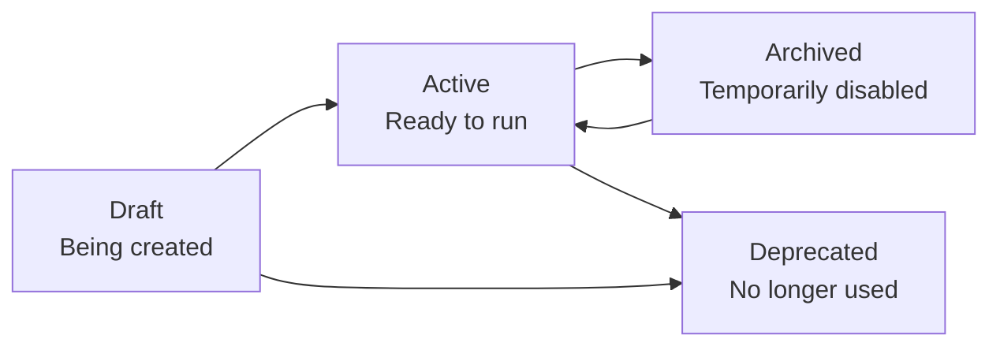

# Test Management

Comprehensive guide to managing test cases, test steps, and test organization in JBTestSuite.

## 📝 Overview

JBTestSuite provides a robust test management system that allows you to create, organize, execute, and maintain automated and manual test cases. The system is designed for scalability, supporting everything from simple smoke tests to complex end-to-end workflows.

## 🏗️ Test Case Structure

### Test Case Components
```
Test Case
├── Basic Information
│   ├── Name (required)
│   ├── Description
│   ├── Category
│   └── Author
├── Configuration
│   ├── Status (draft, active, archived)
│   ├── Priority (critical, high, medium, low)
│   ├── Tags (array of strings)
│   ├── Expected Duration
│   └── Retry Count
├── Automation Settings
│   ├── Is Automated (boolean)
│   └── Metadata (custom configuration)
└── Test Steps (ordered sequence)
    ├── Step Name
    ├── Step Type
    ├── Selector/Target
    ├── Input Data
    ├── Expected Result
    └── Configuration
```

### Test Step Types
- **navigate** - Navigate to a URL
- **click** - Click an element
- **type** - Type text into an input field
- **wait** - Wait for a condition or timeout
- **assert** - Verify element or text exists
- **screenshot** - Capture screenshot
- **api_call** - Make HTTP API request
- **custom** - Execute custom script

## 🎯 Creating Test Cases

### Through the UI

1. **Navigate to Tests Page**
   ```
   http://localhost:3000/tests
   ```

2. **Click "New Test" Button**
   - Opens the test creation form
   - All fields are optional except name

3. **Fill in Basic Information**
   ```
   Name: User Login Flow
   Description: Complete user authentication workflow
   Category: Authentication
   Priority: High
   Tags: login, authentication, critical
   Author: john.doe
   ```

4. **Configure Test Settings**
   ```
   Status: Active
   Is Automated: Yes
   Expected Duration: 120 seconds
   Retry Count: 3
   ```

5. **Add Test Steps**
   ```
   Step 1: Navigate to login page
   Step 2: Enter username
   Step 3: Enter password
   Step 4: Click login button
   Step 5: Verify successful login
   ```

### Through the API

```javascript
// Create test case via API
const testCase = {
  name: "User Registration Flow",
  description: "Test the complete user registration process",
  category: "authentication",
  priority: "high",
  tags: ["registration", "signup", "critical"],
  author: "jane.doe",
  is_automated: true,
  retry_count: 2,
  expected_duration_seconds: 180
}

const response = await fetch('http://localhost:8000/api/v1/tests/', {
  method: 'POST',
  headers: { 'Content-Type': 'application/json' },
  body: JSON.stringify(testCase)
})

const createdTest = await response.json()
```

### Bulk Creation

```javascript
// Create multiple test cases at once
const testCases = [
  {
    name: "Login with Valid Credentials",
    description: "Test login with correct username and password",
    category: "authentication",
    is_automated: true,
    retry_count: 3
  },
  {
    name: "Login with Invalid Credentials", 
    description: "Test login with incorrect credentials",
    category: "authentication",
    is_automated: true,
    retry_count: 1
  },
  {
    name: "Password Reset Flow",
    description: "Test the password reset functionality",
    category: "authentication",
    is_automated: false,
    retry_count: 0
  }
]

const response = await fetch('http://localhost:8000/api/v1/tests/bulk', {
  method: 'POST',
  headers: { 'Content-Type': 'application/json' },
  body: JSON.stringify(testCases)
})

const result = await response.json()
console.log(`Created ${result.success_count} test cases`)
```

## 📋 Managing Test Steps

### Adding Test Steps

#### UI Method
1. Open test case details
2. Click "Add Step" button
3. Fill in step information:
   ```
   Order: 1
   Name: Navigate to Login Page
   Type: navigate
   Input Data: https://myapp.com/login
   Expected Result: Login page loads successfully
   Timeout: 30 seconds
   ```

#### API Method
```javascript
const testStep = {
  order_index: 1,
  name: "Navigate to Login Page",
  description: "Open the application login page",
  step_type: "navigate",
  input_data: "https://myapp.com/login",
  expected_result: "Login page loads with form elements visible",
  timeout_seconds: 30,
  is_optional: false,
  continue_on_failure: false,
  configuration: {
    wait_for: "page_load",
    screenshot_on_complete: true
  }
}

const response = await fetch(`http://localhost:8000/api/v1/tests/${testId}/steps`, {
  method: 'POST',
  headers: { 'Content-Type': 'application/json' },
  body: JSON.stringify(testStep)
})
```

### Step Configuration Examples

#### Navigate Step
```json
{
  "step_type": "navigate",
  "input_data": "https://myapp.com/dashboard",
  "configuration": {
    "wait_for": "page_load",
    "timeout": 30000,
    "screenshot_after": true
  }
}
```

#### Click Step
```json
{
  "step_type": "click", 
  "selector": "#login-button",
  "configuration": {
    "wait_after": 2000,
    "scroll_into_view": true,
    "highlight_element": true
  }
}
```

#### Type Step
```json
{
  "step_type": "type",
  "selector": "input[name='username']",
  "input_data": "test@example.com",
  "configuration": {
    "clear_first": true,
    "typing_delay": 100,
    "press_enter": false
  }
}
```

#### Wait Step
```json
{
  "step_type": "wait",
  "selector": ".loading-spinner",
  "configuration": {
    "wait_for": "element_invisible",
    "timeout": 10000,
    "polling_interval": 500
  }
}
```

#### Assert Step
```json
{
  "step_type": "assert",
  "selector": ".success-message",
  "expected_result": "Welcome back!",
  "configuration": {
    "assertion_type": "text_contains",
    "case_sensitive": false,
    "screenshot_on_failure": true
  }
}
```

## 🏷️ Organization and Filtering

### Categories
Organize test cases by functional areas:
- **Authentication** - Login, logout, registration
- **Core Features** - Main application functionality
- **UI/UX** - User interface and experience tests
- **API** - Backend API testing
- **Performance** - Load and performance tests
- **Security** - Security and vulnerability tests
- **Integration** - Third-party integrations
- **Regression** - Bug fix verification

### Tags
Use tags for flexible filtering:
```javascript
// Common tag patterns
const tagPatterns = {
  priority: ["critical", "high", "medium", "low"],
  type: ["smoke", "regression", "integration", "e2e"],
  platform: ["web", "mobile", "api"],
  environment: ["staging", "production", "development"],
  feature: ["login", "checkout", "payment", "search"],
  status: ["ready", "blocked", "review", "deprecated"]
}

// Example test case with multiple tags
{
  name: "Payment Processing",
  tags: ["critical", "e2e", "payment", "checkout", "web"]
}
```

### Filtering and Search

#### UI Filters
The web interface provides several filtering options:
```
┌─ Filters ──────────────────────┐
│ Status: [All] [Active] [Draft] │
│ Priority: [All] [High] [Low]   │
│ Category: [All] [Auth] [API]   │
│ Tags: [critical] [regression]  │
│ Author: [john.doe] [jane.doe]  │
│ Date Range: [Last 30 days]    │
└────────────────────────────────┘
```

#### API Filtering
```javascript
// Filter test cases via API
const filters = {
  status: 'active',
  category: 'authentication',
  tags: ['critical', 'regression'],
  author: 'john.doe',
  created_after: '2025-08-01T00:00:00Z',
  sort_by: 'priority',
  order: 'desc',
  page: 1,
  limit: 20
}

const queryString = new URLSearchParams(filters).toString()
const response = await fetch(`http://localhost:8000/api/v1/tests/?${queryString}`)
```

#### Search Functionality
```javascript
// Search test cases by name and description
const searchResponse = await fetch(
  'http://localhost:8000/api/v1/tests/search?q=login&page=1&limit=10'
)
const searchResults = await searchResponse.json()
```

## 📊 Test Case Lifecycle

### Status Workflow


### Status Meanings
- **Draft**: Test case is being created or modified
- **Active**: Test case is ready for execution
- **Archived**: Test case is temporarily disabled but may be reactivated
- **Deprecated**: Test case is no longer relevant and should not be used

### Priority Guidelines
- **Critical**: Must pass for product release
- **High**: Important functionality, should pass
- **Medium**: Standard features, nice to have passing
- **Low**: Edge cases or minor features

## 🔄 Advanced Features

### Test Case Templates
Create reusable templates for common test patterns:

```javascript
// Login template
const loginTemplate = {
  name: "Login Test Template",
  category: "authentication",
  steps: [
    {
      order_index: 1,
      name: "Navigate to login page",
      step_type: "navigate",
      input_data: "{{BASE_URL}}/login"
    },
    {
      order_index: 2,
      name: "Enter username",
      step_type: "type",
      selector: "input[name='username']",
      input_data: "{{USERNAME}}"
    },
    {
      order_index: 3,
      name: "Enter password", 
      step_type: "type",
      selector: "input[name='password']",
      input_data: "{{PASSWORD}}"
    },
    {
      order_index: 4,
      name: "Click login button",
      step_type: "click",
      selector: "#login-button"
    },
    {
      order_index: 5,
      name: "Verify login success",
      step_type: "assert",
      selector: ".welcome-message",
      expected_result: "Welcome"
    }
  ]
}
```

### Variable Substitution
Use variables in test steps for flexibility:

```javascript
// Test case with variables
{
  name: "Login with Dynamic Data",
  metadata: {
    variables: {
      BASE_URL: "https://staging.myapp.com",
      USERNAME: "test@example.com",
      PASSWORD: "SecurePassword123"
    }
  },
  steps: [
    {
      step_type: "navigate",
      input_data: "{{BASE_URL}}/login"
    },
    {
      step_type: "type",
      selector: "#username",
      input_data: "{{USERNAME}}"
    }
  ]
}
```

### Test Dependencies
Define test execution order and dependencies:

```javascript
{
  name: "User Profile Update",
  metadata: {
    dependencies: [
      "user-login-test",      // Must pass first
      "user-profile-load"     // Must pass first
    ],
    execution_order: 10       // Higher numbers run later
  }
}
```

## 📈 Test Metrics and Reporting

### Test Case Statistics
The system tracks various metrics:
- **Total test cases** by status and category
- **Execution frequency** and success rates
- **Average execution time** per test case
- **Step success/failure rates**
- **Author productivity** metrics

### API Endpoints for Metrics
```javascript
// Get test case statistics
const stats = await fetch('http://localhost:8000/api/v1/tests/stats')
const data = await stats.json()

// Example response
{
  total_tests: 150,
  by_status: {
    active: 120,
    draft: 20,
    archived: 10
  },
  by_priority: {
    critical: 25,
    high: 45,
    medium: 60,
    low: 20
  },
  by_category: {
    authentication: 30,
    core_features: 80,
    api: 25,
    ui: 15
  }
}
```

## 🔧 Best Practices

### Test Case Design
1. **Clear Naming**: Use descriptive, action-oriented names
2. **Single Responsibility**: One test case should test one specific flow
3. **Independence**: Test cases should not depend on each other's state
4. **Maintainability**: Write tests that are easy to understand and modify

### Step Organization
1. **Logical Order**: Steps should follow natural user workflows
2. **Atomic Actions**: Each step should perform one specific action
3. **Clear Expectations**: Define expected results for each step
4. **Error Handling**: Use continue_on_failure appropriately

### Metadata Usage
1. **Consistent Tagging**: Establish and follow tagging conventions
2. **Meaningful Categories**: Use categories that reflect your application structure
3. **Documentation**: Include relevant context in descriptions
4. **Configuration**: Store environment-specific settings in metadata

### Example Well-Structured Test Case
```javascript
{
  name: "E2E Checkout Flow - Credit Card Payment",
  description: "Complete end-to-end test of the checkout process using credit card payment method, including cart addition, shipping selection, and payment confirmation",
  category: "e2e",
  priority: "critical",
  tags: ["checkout", "payment", "e2e", "smoke"],
  author: "qa-team",
  expected_duration_seconds: 180,
  is_automated: true,
  retry_count: 2,
  metadata: {
    browser: "chrome",
    viewport: "1920x1080",
    test_data_set: "checkout_flow_data",
    environment: "staging"
  },
  steps: [
    {
      order_index: 1,
      name: "Navigate to product page",
      step_type: "navigate",
      input_data: "{{BASE_URL}}/products/test-product",
      expected_result: "Product page loads with buy button visible",
      timeout_seconds: 30
    },
    {
      order_index: 2,
      name: "Add product to cart",
      step_type: "click", 
      selector: "[data-testid='add-to-cart-button']",
      expected_result: "Product added to cart, cart count increases",
      timeout_seconds: 10
    }
    // ... additional steps
  ]
}
```

---

*This comprehensive test management system provides the foundation for reliable automated testing. For execution details, see [Test Execution Guide](test-execution.md).*