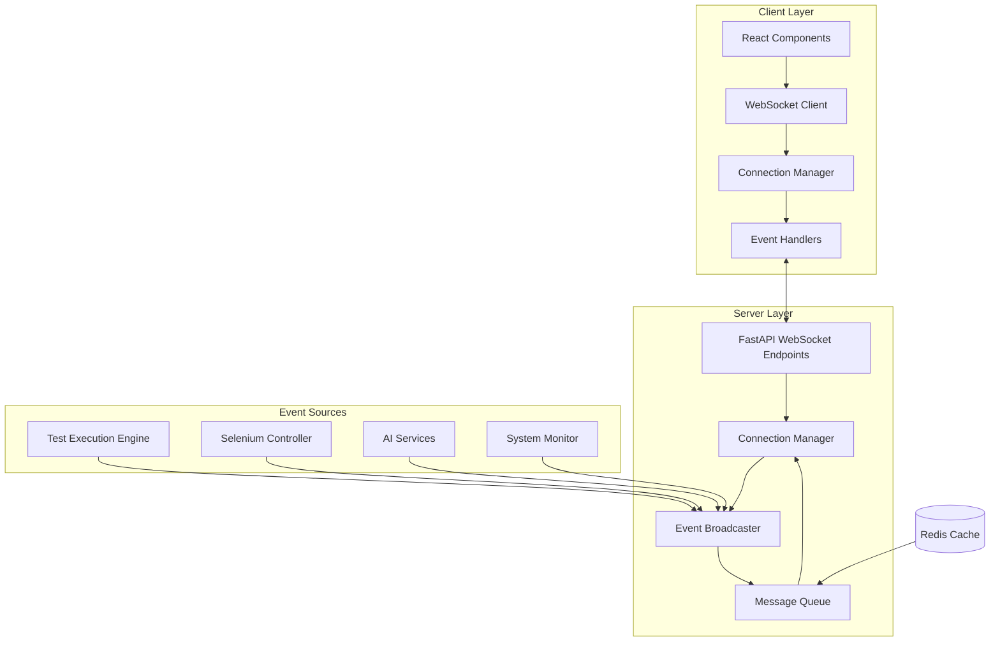

# Real-time Features (WebSockets)

JBTestSuite provides real-time communication capabilities through WebSocket connections, enabling live monitoring of test executions, instant notifications, and responsive user interfaces.

## Overview

The WebSocket implementation allows for:
- **Live Test Monitoring**: Real-time updates during test execution
- **Instant Notifications**: Immediate alerts for test completion and failures
- **Collaborative Features**: Multiple users monitoring same test runs
- **Resource Status Updates**: Live system resource and queue information

## Architecture



## Core Features

### Real-time Test Monitoring

#### Live Execution Updates
- **Test Progress**: Step-by-step execution progress
- **Browser Actions**: Live browser interaction events
- **Screenshot Capture**: Real-time screenshot streaming
- **Performance Metrics**: Execution time and resource usage updates

#### Status Broadcasting
```javascript
// Client-side event handling
websocket.onmessage = (event) => {
    const message = JSON.parse(event.data);
    
    switch(message.type) {
        case 'test_started':
            updateTestStatus(message.test_id, 'running');
            break;
        case 'test_progress':
            updateProgress(message.test_id, message.progress);
            break;
        case 'test_completed':
            handleTestCompletion(message.test_id, message.result);
            break;
        case 'screenshot_captured':
            displayScreenshot(message.test_id, message.screenshot_url);
            break;
    }
};
```

### Connection Management

#### Client Connection Handling
- **Auto-reconnection**: Automatic reconnection on connection loss
- **Connection Health**: Heartbeat monitoring and status updates
- **Multiple Clients**: Support for multiple concurrent connections
- **Authentication**: Secure connection establishment and maintenance

#### Server-side Management
```python
class WebSocketManager:
    def __init__(self):
        self.active_connections: Dict[str, WebSocket] = {}
        self.connection_groups: Dict[str, Set[str]] = {}
    
    async def connect(self, websocket: WebSocket, connection_id: str):
        await websocket.accept()
        self.active_connections[connection_id] = websocket
    
    async def disconnect(self, connection_id: str):
        if connection_id in self.active_connections:
            del self.active_connections[connection_id]
    
    async def broadcast_to_group(self, group_id: str, message: dict):
        if group_id in self.connection_groups:
            for connection_id in self.connection_groups[group_id]:
                await self.send_personal_message(connection_id, message)
```

## WebSocket Endpoints

### Connection Establishment

```python
# WebSocket connection endpoint
@app.websocket("/ws/{client_id}")
async def websocket_endpoint(websocket: WebSocket, client_id: str):
    await websocket_manager.connect(websocket, client_id)
    
    try:
        while True:
            # Keep connection alive and handle incoming messages
            data = await websocket.receive_text()
            message = json.loads(data)
            
            await handle_client_message(client_id, message)
            
    except WebSocketDisconnect:
        await websocket_manager.disconnect(client_id)
        
    except Exception as e:
        logger.error(f"WebSocket error for client {client_id}: {e}")
        await websocket_manager.disconnect(client_id)
```

### Event Broadcasting

```python
# Test execution events
async def broadcast_test_event(test_id: str, event_type: str, data: dict):
    message = {
        "type": event_type,
        "test_id": test_id,
        "timestamp": datetime.utcnow().isoformat(),
        "data": data
    }
    
    # Broadcast to all clients monitoring this test
    await websocket_manager.broadcast_to_group(f"test_{test_id}", message)
    
    # Also broadcast to general monitoring clients
    await websocket_manager.broadcast_to_group("general", message)

# System status events  
async def broadcast_system_status(status_data: dict):
    message = {
        "type": "system_status",
        "timestamp": datetime.utcnow().isoformat(),
        "data": status_data
    }
    
    await websocket_manager.broadcast_to_group("system_monitor", message)
```

## Message Types and Schemas

### Test Execution Messages

```typescript
// Test lifecycle events
interface TestStartedMessage {
    type: 'test_started';
    test_id: string;
    test_name: string;
    timestamp: string;
    estimated_duration?: number;
}

interface TestProgressMessage {
    type: 'test_progress';
    test_id: string;
    step_index: number;
    step_name: string;
    progress_percentage: number;
    timestamp: string;
}

interface TestCompletedMessage {
    type: 'test_completed';
    test_id: string;
    result: 'passed' | 'failed' | 'error';
    duration: number;
    timestamp: string;
    summary?: string;
}
```

### Browser Automation Messages

```typescript
// Selenium events
interface BrowserActionMessage {
    type: 'browser_action';
    test_id: string;
    action: string;
    element?: string;
    url?: string;
    timestamp: string;
}

interface ScreenshotCapturedMessage {
    type: 'screenshot_captured';
    test_id: string;
    screenshot_id: string;
    screenshot_url: string;
    timestamp: string;
}

interface PageLoadMessage {
    type: 'page_loaded';
    test_id: string;
    url: string;
    load_time: number;
    timestamp: string;
}
```

### System Status Messages

```typescript
// System monitoring
interface SystemStatusMessage {
    type: 'system_status';
    cpu_usage: number;
    memory_usage: number;
    active_tests: number;
    queue_size: number;
    timestamp: string;
}

interface ResourceAlertMessage {
    type: 'resource_alert';
    alert_type: 'high_cpu' | 'high_memory' | 'disk_space';
    severity: 'warning' | 'critical';
    message: string;
    timestamp: string;
}
```

## Client-side Implementation

### React Hook for WebSocket Connection

```typescript
import { useEffect, useState, useRef } from 'react';

interface UseWebSocketOptions {
    url: string;
    onMessage?: (message: any) => void;
    onConnect?: () => void;
    onDisconnect?: () => void;
    reconnectInterval?: number;
}

export function useWebSocket(options: UseWebSocketOptions) {
    const [isConnected, setIsConnected] = useState(false);
    const [lastMessage, setLastMessage] = useState<any>(null);
    const websocketRef = useRef<WebSocket | null>(null);
    const reconnectTimeoutRef = useRef<NodeJS.Timeout>();
    
    const connect = useCallback(() => {
        try {
            const websocket = new WebSocket(options.url);
            
            websocket.onopen = () => {
                setIsConnected(true);
                options.onConnect?.();
                
                // Clear any existing reconnect timeout
                if (reconnectTimeoutRef.current) {
                    clearTimeout(reconnectTimeoutRef.current);
                }
            };
            
            websocket.onmessage = (event) => {
                const message = JSON.parse(event.data);
                setLastMessage(message);
                options.onMessage?.(message);
            };
            
            websocket.onclose = () => {
                setIsConnected(false);
                options.onDisconnect?.();
                
                // Attempt reconnection
                if (options.reconnectInterval) {
                    reconnectTimeoutRef.current = setTimeout(
                        connect,
                        options.reconnectInterval
                    );
                }
            };
            
            websocket.onerror = (error) => {
                console.error('WebSocket error:', error);
                setIsConnected(false);
            };
            
            websocketRef.current = websocket;
            
        } catch (error) {
            console.error('Failed to create WebSocket connection:', error);
            setIsConnected(false);
        }
    }, [options]);
    
    const sendMessage = useCallback((message: any) => {
        if (websocketRef.current && isConnected) {
            websocketRef.current.send(JSON.stringify(message));
        }
    }, [isConnected]);
    
    const disconnect = useCallback(() => {
        if (reconnectTimeoutRef.current) {
            clearTimeout(reconnectTimeoutRef.current);
        }
        
        if (websocketRef.current) {
            websocketRef.current.close();
            websocketRef.current = null;
        }
        
        setIsConnected(false);
    }, []);
    
    useEffect(() => {
        connect();
        return disconnect;
    }, [connect, disconnect]);
    
    return {
        isConnected,
        lastMessage,
        sendMessage,
        disconnect
    };
}
```

### Test Monitor Component

```typescript
import React, { useState } from 'react';
import { useWebSocket } from './useWebSocket';

interface TestMonitorProps {
    testId: string;
}

export function TestMonitor({ testId }: TestMonitorProps) {
    const [testStatus, setTestStatus] = useState<string>('idle');
    const [progress, setProgress] = useState<number>(0);
    const [screenshots, setScreenshots] = useState<string[]>([]);
    
    const { isConnected, sendMessage } = useWebSocket({
        url: `ws://localhost:8000/ws/test-monitor-${testId}`,
        
        onMessage: (message) => {
            switch (message.type) {
                case 'test_started':
                    setTestStatus('running');
                    break;
                    
                case 'test_progress':
                    setProgress(message.progress_percentage);
                    break;
                    
                case 'test_completed':
                    setTestStatus(message.result);
                    setProgress(100);
                    break;
                    
                case 'screenshot_captured':
                    setScreenshots(prev => [...prev, message.screenshot_url]);
                    break;
            }
        },
        
        onConnect: () => {
            // Subscribe to test events
            sendMessage({
                type: 'subscribe',
                group: `test_${testId}`
            });
        },
        
        reconnectInterval: 3000
    });
    
    return (
        <div className="test-monitor">
            <div className="connection-status">
                Status: {isConnected ? 'Connected' : 'Disconnected'}
            </div>
            
            <div className="test-status">
                Test Status: {testStatus}
            </div>
            
            <div className="progress-bar">
                <div 
                    className="progress-fill"
                    style={{ width: `${progress}%` }}
                />
            </div>
            
            <div className="screenshots">
                {screenshots.map((url, index) => (
                    
                ))}
            </div>
        </div>
    );
}
```

## Security Considerations

### Authentication and Authorization

```python
# WebSocket authentication
async def authenticate_websocket(websocket: WebSocket, token: str):
    try:
        # Validate JWT token
        payload = jwt.decode(token, SECRET_KEY, algorithms=['HS256'])
        user_id = payload.get('user_id')
        
        if not user_id:
            await websocket.close(code=4001, reason="Invalid token")
            return None
            
        return user_id
        
    except jwt.ExpiredSignatureError:
        await websocket.close(code=4001, reason="Token expired")
        return None
    except jwt.InvalidTokenError:
        await websocket.close(code=4001, reason="Invalid token")
        return None

@app.websocket("/ws/{client_id}")
async def websocket_endpoint(websocket: WebSocket, client_id: str, token: str):
    user_id = await authenticate_websocket(websocket, token)
    if not user_id:
        return
        
    await websocket_manager.connect(websocket, client_id, user_id)
    # ... rest of connection handling
```

### Message Validation

```python
from pydantic import BaseModel, ValidationError

class WebSocketMessage(BaseModel):
    type: str
    data: dict
    timestamp: Optional[str] = None

async def handle_client_message(client_id: str, raw_message: str):
    try:
        # Validate message format
        message_data = json.loads(raw_message)
        message = WebSocketMessage(**message_data)
        
        # Route to appropriate handler
        await route_message(client_id, message)
        
    except (json.JSONDecodeError, ValidationError) as e:
        await send_error_message(client_id, f"Invalid message format: {e}")
    except Exception as e:
        logger.error(f"Error handling message from {client_id}: {e}")
```

## Performance Optimization

### Connection Pooling

```python
class WebSocketPool:
    def __init__(self, max_connections_per_user: int = 10):
        self.max_connections_per_user = max_connections_per_user
        self.user_connections: Dict[str, List[str]] = {}
    
    async def add_connection(self, user_id: str, connection_id: str):
        if user_id not in self.user_connections:
            self.user_connections[user_id] = []
        
        user_conns = self.user_connections[user_id]
        
        # Enforce connection limit
        if len(user_conns) >= self.max_connections_per_user:
            # Close oldest connection
            oldest_conn = user_conns.pop(0)
            await websocket_manager.disconnect(oldest_conn)
        
        user_conns.append(connection_id)
```

### Message Batching

```python
import asyncio
from collections import defaultdict

class MessageBatcher:
    def __init__(self, batch_size: int = 10, batch_timeout: float = 0.1):
        self.batch_size = batch_size
        self.batch_timeout = batch_timeout
        self.pending_messages: Dict[str, List[dict]] = defaultdict(list)
        self.batch_tasks: Dict[str, asyncio.Task] = {}
    
    async def add_message(self, group_id: str, message: dict):
        self.pending_messages[group_id].append(message)
        
        # Start batch timer if not already running
        if group_id not in self.batch_tasks:
            self.batch_tasks[group_id] = asyncio.create_task(
                self._batch_timer(group_id)
            )
        
        # Send immediately if batch is full
        if len(self.pending_messages[group_id]) >= self.batch_size:
            await self._send_batch(group_id)
    
    async def _batch_timer(self, group_id: str):
        await asyncio.sleep(self.batch_timeout)
        await self._send_batch(group_id)
    
    async def _send_batch(self, group_id: str):
        if group_id in self.pending_messages and self.pending_messages[group_id]:
            batch = self.pending_messages[group_id]
            self.pending_messages[group_id] = []
            
            batch_message = {
                "type": "batch",
                "messages": batch,
                "count": len(batch)
            }
            
            await websocket_manager.broadcast_to_group(group_id, batch_message)
        
        # Clean up batch task
        if group_id in self.batch_tasks:
            del self.batch_tasks[group_id]
```

## Monitoring and Analytics

### Connection Metrics

```python
class WebSocketMetrics:
    def __init__(self):
        self.connection_count = 0
        self.message_count = 0
        self.bytes_sent = 0
        self.bytes_received = 0
        self.connection_durations: List[float] = []
    
    async def track_connection(self, connection_id: str):
        self.connection_count += 1
        start_time = time.time()
        
        # Store connection start time for duration tracking
        self.connection_starts[connection_id] = start_time
    
    async def track_disconnection(self, connection_id: str):
        if connection_id in self.connection_starts:
            duration = time.time() - self.connection_starts[connection_id]
            self.connection_durations.append(duration)
            del self.connection_starts[connection_id]
    
    async def get_metrics(self) -> dict:
        return {
            "active_connections": len(websocket_manager.active_connections),
            "total_connections": self.connection_count,
            "total_messages": self.message_count,
            "bytes_sent": self.bytes_sent,
            "bytes_received": self.bytes_received,
            "average_connection_duration": (
                sum(self.connection_durations) / len(self.connection_durations)
                if self.connection_durations else 0
            )
        }
```

## Troubleshooting

### Common Issues

1. **Connection Drops**
   - Check network stability
   - Verify WebSocket proxy configuration
   - Monitor server resource usage

2. **Message Loss**
   - Implement message acknowledgment
   - Use message queuing for critical events
   - Monitor message delivery rates

3. **Performance Issues**
   - Implement message batching
   - Limit broadcast frequency
   - Monitor memory usage for large client pools

### Debug Tools

```python
# WebSocket debug middleware
class WebSocketDebugMiddleware:
    def __init__(self):
        self.message_log: List[dict] = []
        self.max_log_size = 1000
    
    async def log_message(self, direction: str, client_id: str, message: dict):
        log_entry = {
            "timestamp": datetime.utcnow().isoformat(),
            "direction": direction,  # "in" or "out"
            "client_id": client_id,
            "message_type": message.get("type"),
            "message_size": len(json.dumps(message))
        }
        
        self.message_log.append(log_entry)
        
        # Maintain log size limit
        if len(self.message_log) > self.max_log_size:
            self.message_log.pop(0)
    
    async def get_debug_info(self, client_id: str = None) -> dict:
        if client_id:
            client_logs = [
                log for log in self.message_log 
                if log["client_id"] == client_id
            ]
            return {"client_logs": client_logs}
        
        return {
            "total_messages": len(self.message_log),
            "recent_messages": self.message_log[-10:],
            "active_connections": len(websocket_manager.active_connections)
        }
```

---

*For more information about WebSocket implementation details, see the [API Documentation](../api/README.md) and [Frontend Guide](../frontend/README.md).*