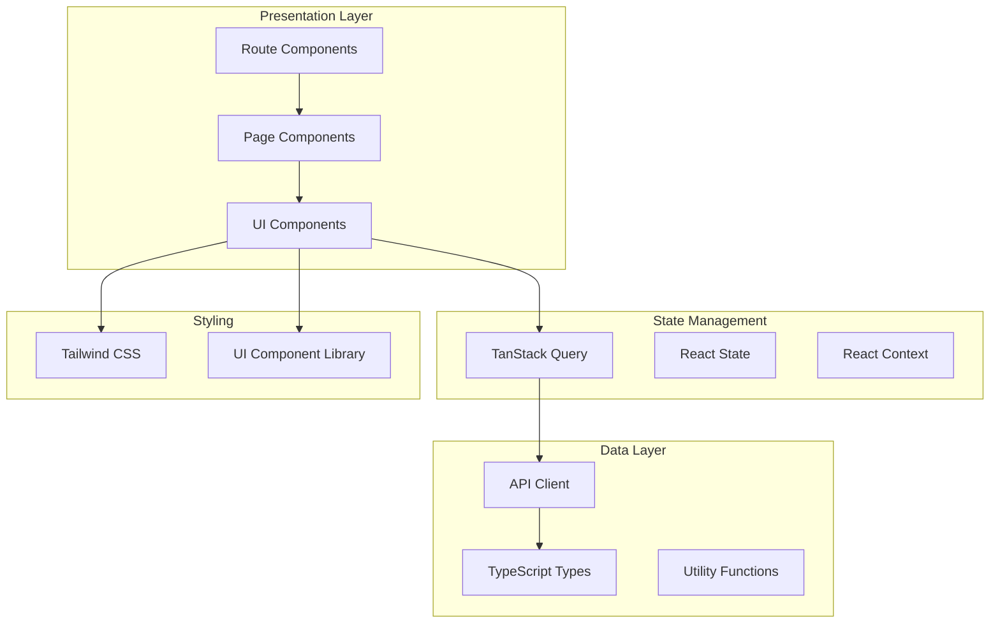
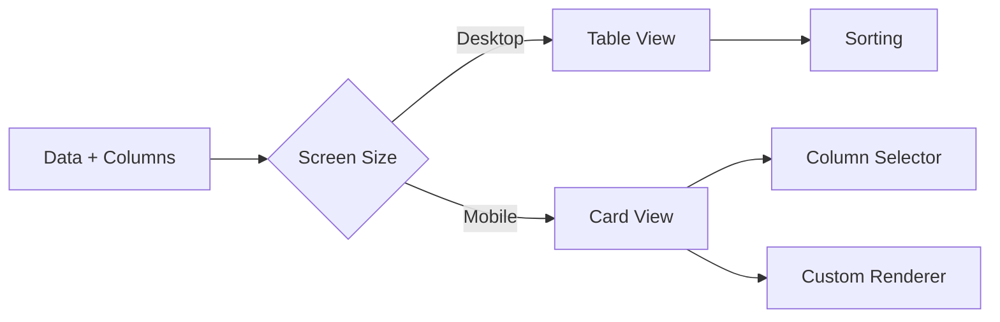

# Frontend Architecture & Components

Complete documentation for the React/TypeScript frontend of JBTestSuite.

## 🏗️ Frontend Architecture Overview

The frontend is built using modern React patterns with TypeScript, focusing on component reusability, type safety, and responsive design.

### Technology Stack
- **React 18** with functional components and hooks
- **TypeScript** for type safety and better developer experience
- **TanStack Router** for file-based routing with type safety
- **TanStack Query** for server state management and caching
- **Tailwind CSS** for styling with utility classes
- **Vite** for fast development and optimized builds

### Architecture Patterns


## 📁 Project Structure

```
client/src/
├── components/           # Reusable UI components
│   ├── ui/              # Base UI components (buttons, inputs, etc.)
│   └── test-cases/      # Domain-specific components
├── hooks/               # Custom React hooks
│   ├── useTestCases.ts  # Test case management hooks
│   ├── useDebounce.ts   # Utility hooks
│   └── index.ts         # Hook exports
├── routes/              # File-based routing pages
│   ├── __root.tsx       # Root layout component
│   ├── index.tsx        # Home page
│   ├── tests.tsx        # Test cases list page
│   └── tests.$testId.tsx # Test case detail page
├── types/               # TypeScript type definitions
│   └── index.ts         # Shared types
├── api/                 # API client and services
│   ├── client.ts        # HTTP client configuration
│   ├── testCases.ts     # Test case API methods
│   └── index.ts         # API exports
├── utils/               # Utility functions
│   └── export.ts        # Data export utilities
├── index.css            # Global styles and Tailwind imports
└── main.tsx            # Application entry point
```

## 🧩 Core Components

### 1. UI Component Library

The application uses a custom UI component library built with Tailwind CSS for consistency and reusability.

#### Base Components
- **Button** - Configurable button with variants and sizes
- **Input** - Form input with validation states
- **Select** - Dropdown selection component
- **Table** - Data table with sorting and pagination
- **Modal** - Overlay modal with backdrop
- **Loading** - Loading indicators and skeletons

#### Advanced Components
- **ResponsiveTable** - Adaptive table that transforms to cards on mobile
- **ResponsiveGrid** - Flexible grid layout system
- **ResponsiveDrawer** - Mobile-first drawer/sidebar component
- **AdvancedSearchInput** - Search with filters and suggestions
- **BulkActions** - Batch operation controls

### 2. Domain Components

#### Test Case Components
Located in `components/test-cases/`:

- **TestCaseCard** - Individual test case display card
- **StatusBadge** - Visual status indicator
- **PriorityBadge** - Priority level indicator

## 🎯 Component Architecture Deep Dive

### ResponsiveTable Component

A sophisticated table component that adapts to different screen sizes:

```typescript
interface ResponsiveTableProps<T> extends Omit<TableProps<T>, 'columns'> {
  columns: Array<
    TableColumn<T> & {
      priority?: 'high' | 'medium' | 'low'     // Column importance
      showOnMobile?: boolean                    // Mobile visibility
      mobileLabel?: string                      // Mobile display label
    }
  >
  mobileBreakpoint?: 'sm' | 'md' | 'lg'        // Responsive breakpoint
  showMobileCards?: boolean                     // Card view on mobile
  mobileCardRenderer?: (item: T, index: number) => React.ReactNode
  compactMode?: boolean                         // Compact display mode
}
```

**Key Features:**
- **Responsive Design**: Automatically switches between table and card views
- **Column Prioritization**: Shows important columns first on mobile
- **Custom Renderers**: Allows custom mobile card layouts
- **Column Selection**: Mobile drawer for column visibility control
- **Type Safety**: Full TypeScript support with generics

**Architecture:**


### State Management Architecture

#### TanStack Query Integration

The application uses TanStack Query for server state management:

```typescript
// hooks/useTestCases.ts
export function useTestCases(filters?: FilterParams) {
  const queryClient = useQueryClient()

  // Fetch test cases with caching and background updates
  const {
    data: testCases,
    isLoading,
    error,
    refetch
  } = useQuery({
    queryKey: ['testCases', filters],
    queryFn: () => testCasesApi.getAll(filters),
    staleTime: 30000,      // Consider fresh for 30 seconds
    cacheTime: 300000,     // Keep in cache for 5 minutes
    refetchOnWindowFocus: true
  })

  // Create new test case with optimistic updates
  const createMutation = useMutation({
    mutationFn: testCasesApi.create,
    onMutate: async (newTestCase) => {
      // Cancel outgoing refetches
      await queryClient.cancelQueries({ queryKey: ['testCases'] })
      
      // Snapshot previous value
      const previousTestCases = queryClient.getQueryData(['testCases'])
      
      // Optimistically update cache
      queryClient.setQueryData(['testCases'], (old: any) => ({
        ...old,
        items: [...(old?.items || []), { ...newTestCase, id: 'temp-id' }]
      }))
      
      return { previousTestCases }
    },
    onError: (err, newTestCase, context) => {
      // Rollback on error
      if (context?.previousTestCases) {
        queryClient.setQueryData(['testCases'], context.previousTestCases)
      }
    },
    onSettled: () => {
      // Refetch after mutation
      queryClient.invalidateQueries({ queryKey: ['testCases'] })
    }
  })

  return {
    testCases,
    isLoading,
    error,
    refetch,
    createTestCase: createMutation.mutate,
    isCreating: createMutation.isLoading
  }
}
```

#### Custom Hooks Pattern

The application uses custom hooks to encapsulate complex logic:

```typescript
// hooks/useTestCaseFilters.ts
export function useTestCaseFilters() {
  const [filters, setFilters] = useState<FilterParams>({})
  const [searchQuery, setSearchQuery] = useState('')
  const debouncedSearch = useDebounce(searchQuery, 300)

  const updateFilter = useCallback((key: keyof FilterParams, value: any) => {
    setFilters(prev => ({
      ...prev,
      [key]: value
    }))
  }, [])

  const clearFilters = useCallback(() => {
    setFilters({})
    setSearchQuery('')
  }, [])

  const activeFiltersCount = useMemo(() => {
    return Object.values(filters).filter(Boolean).length
  }, [filters])

  return {
    filters: {
      ...filters,
      q: debouncedSearch || undefined
    },
    searchQuery,
    setSearchQuery,
    updateFilter,
    clearFilters,
    activeFiltersCount
  }
}
```

## 🎨 Styling Architecture

### Tailwind CSS Configuration

```javascript
// tailwind.config.js
module.exports = {
  content: [
    "./index.html",
    "./src/**/*.{js,ts,jsx,tsx}",
  ],
  theme: {
    extend: {
      colors: {
        primary: {
          50: '#eff6ff',
          500: '#3b82f6',
          600: '#2563eb',
          700: '#1d4ed8',
        },
        success: {
          50: '#f0fdf4',
          500: '#22c55e',
          600: '#16a34a',
        },
        warning: {
          50: '#fffbeb',
          500: '#f59e0b',
          600: '#d97706',
        },
        error: {
          50: '#fef2f2',
          500: '#ef4444',
          600: '#dc2626',
        }
      },
      screens: {
        'xs': '475px',
      },
      animation: {
        'fade-in': 'fadeIn 0.2s ease-in-out',
        'slide-up': 'slideUp 0.3s ease-out',
      }
    },
  },
  plugins: [
    require('@tailwindcss/forms'),
    require('@tailwindcss/typography'),
  ],
}
```

### Component Styling Patterns

#### Variant-based Components
```typescript
// components/ui/Button.tsx
interface ButtonProps {
  variant?: 'primary' | 'secondary' | 'outline' | 'ghost' | 'danger'
  size?: 'xs' | 'sm' | 'md' | 'lg' | 'xl'
  children: React.ReactNode
  // ... other props
}

const buttonVariants = {
  primary: 'bg-primary-600 text-white hover:bg-primary-700 focus:ring-primary-500',
  secondary: 'bg-gray-600 text-white hover:bg-gray-700 focus:ring-gray-500',
  outline: 'border border-gray-300 text-gray-700 hover:bg-gray-50 focus:ring-primary-500',
  ghost: 'text-gray-700 hover:bg-gray-100 focus:ring-primary-500',
  danger: 'bg-error-600 text-white hover:bg-error-700 focus:ring-error-500'
}

const buttonSizes = {
  xs: 'px-2.5 py-1.5 text-xs',
  sm: 'px-3 py-2 text-sm',
  md: 'px-4 py-2 text-sm',
  lg: 'px-4 py-2 text-base',
  xl: 'px-6 py-3 text-base'
}
```

#### Responsive Design Patterns
```typescript
// Mobile-first responsive design
const responsiveClasses = {
  container: 'w-full px-4 sm:px-6 lg:px-8',
  grid: 'grid grid-cols-1 md:grid-cols-2 lg:grid-cols-3 gap-4',
  card: 'bg-white rounded-lg shadow-sm p-4 md:p-6',
  text: 'text-sm md:text-base',
  spacing: 'space-y-4 md:space-y-6'
}
```

## 🔗 API Integration

### HTTP Client Configuration

```typescript
// api/client.ts
import axios from 'axios'

const API_BASE_URL = import.meta.env.VITE_API_URL || 'http://localhost:8000'

export const apiClient = axios.create({
  baseURL: `${API_BASE_URL}/api/v1`,
  timeout: 10000,
  headers: {
    'Content-Type': 'application/json',
  },
})

// Request interceptor for authentication
apiClient.interceptors.request.use(
  (config) => {
    const token = localStorage.getItem('auth_token')
    if (token) {
      config.headers.Authorization = `Bearer ${token}`
    }
    return config
  },
  (error) => Promise.reject(error)
)

// Response interceptor for error handling
apiClient.interceptors.response.use(
  (response) => response,
  (error) => {
    if (error.response?.status === 401) {
      localStorage.removeItem('auth_token')
      window.location.href = '/login'
    }
    return Promise.reject(error)
  }
)
```

### API Service Layer

```typescript
// api/testCases.ts
import { apiClient } from './client'
import type { 
  TestCaseCreate, 
  TestCaseUpdate, 
  TestCaseResponse, 
  PaginatedResponse,
  FilterParams
} from '../types'

export const testCasesApi = {
  // Get all test cases with optional filtering
  getAll: async (params?: FilterParams): Promise<PaginatedResponse<TestCaseResponse>> => {
    const response = await apiClient.get('/tests/', { params })
    return response.data
  },

  // Get single test case by ID
  getById: async (id: string, includeSteps = true): Promise<TestCaseResponse> => {
    const response = await apiClient.get(`/tests/${id}`, {
      params: { include_steps: includeSteps }
    })
    return response.data
  },

  // Create new test case
  create: async (data: TestCaseCreate): Promise<TestCaseResponse> => {
    const response = await apiClient.post('/tests/', data)
    return response.data
  },

  // Update existing test case
  update: async (id: string, data: TestCaseUpdate): Promise<TestCaseResponse> => {
    const response = await apiClient.put(`/tests/${id}`, data)
    return response.data
  },

  // Delete test case
  delete: async (id: string): Promise<void> => {
    await apiClient.delete(`/tests/${id}`)
  },

  // Search test cases
  search: async (query: string, params?: { page?: number; limit?: number }): Promise<PaginatedResponse<TestCaseResponse>> => {
    const response = await apiClient.get('/tests/search', {
      params: { q: query, ...params }
    })
    return response.data
  },

  // Bulk operations
  bulkCreate: async (data: TestCaseCreate[]): Promise<{ success_count: number; failure_count: number }> => {
    const response = await apiClient.post('/tests/bulk', data)
    return response.data
  }
}
```

## 🛣️ Routing Architecture

### File-based Routing with TanStack Router

```typescript
// routes/__root.tsx - Root layout
import { Outlet, createRootRoute } from '@tanstack/react-router'
import { TanStackRouterDevtools } from '@tanstack/router-devtools'

export const Route = createRootRoute({
  component: () => (
    <div className="min-h-screen bg-gray-50">
      <nav className="bg-white shadow-sm border-b border-gray-200">
        {/* Navigation component */}
      </nav>
      
      <main className="container mx-auto px-4 py-8">
        <Outlet />
      </main>
      
      <TanStackRouterDevtools />
    </div>
  ),
})
```

```typescript
// routes/tests.tsx - Test cases list page
import { createFileRoute } from '@tanstack/react-router'
import { useTestCases } from '../hooks/useTestCases'
import { TestCasesList } from '../components/test-cases/TestCasesList'

export const Route = createFileRoute('/tests')({
  component: TestsPage,
})

function TestsPage() {
  const { testCases, isLoading, error } = useTestCases()

  if (isLoading) return <div>Loading...</div>
  if (error) return <div>Error: {error.message}</div>

  return (
    <div className="space-y-6">
      <div className="flex justify-between items-center">
        <h1 className="text-2xl font-bold text-gray-900">Test Cases</h1>
        <button className="btn-primary">Create Test</button>
      </div>
      
      <TestCasesList testCases={testCases} />
    </div>
  )
}
```

## 🎭 Component Composition Patterns

### Compound Components
```typescript
// components/ui/Modal.tsx
export const Modal = {
  Root: ModalRoot,
  Header: ModalHeader,
  Body: ModalBody,
  Footer: ModalFooter,
}

// Usage:
<Modal.Root isOpen={isOpen} onClose={onClose}>
  <Modal.Header>
    <h2>Confirm Delete</h2>
  </Modal.Header>
  <Modal.Body>
    <p>Are you sure you want to delete this test case?</p>
  </Modal.Body>
  <Modal.Footer>
    <Button variant="ghost" onClick={onClose}>Cancel</Button>
    <Button variant="danger" onClick={onConfirm}>Delete</Button>
  </Modal.Footer>
</Modal.Root>
```

### Render Props Pattern
```typescript
// components/DataFetcher.tsx
interface DataFetcherProps<T> {
  queryKey: string[]
  queryFn: () => Promise<T>
  children: (props: {
    data?: T
    isLoading: boolean
    error?: Error
    refetch: () => void
  }) => React.ReactNode
}

export function DataFetcher<T>({ queryKey, queryFn, children }: DataFetcherProps<T>) {
  const { data, isLoading, error, refetch } = useQuery({
    queryKey,
    queryFn
  })

  return children({ data, isLoading, error, refetch })
}

// Usage:
<DataFetcher
  queryKey={['testCase', testId]}
  queryFn={() => testCasesApi.getById(testId)}
>
  {({ data, isLoading, error }) => (
    isLoading ? <Loading /> : 
    error ? <Error message={error.message} /> :
    <TestCaseDetail testCase={data} />
  )}
</DataFetcher>
```

## 📱 Responsive Design System

### Breakpoint Strategy
```typescript
// utils/responsive.ts
export const breakpoints = {
  xs: '0px',     // Mobile first
  sm: '640px',   // Small devices
  md: '768px',   // Medium devices  
  lg: '1024px',  // Large devices
  xl: '1280px',  // Extra large devices
  '2xl': '1536px' // 2X large devices
}

export const useBreakpoint = () => {
  const [breakpoint, setBreakpoint] = useState('xs')
  
  useEffect(() => {
    const handleResize = () => {
      const width = window.innerWidth
      if (width >= 1536) setBreakpoint('2xl')
      else if (width >= 1280) setBreakpoint('xl')
      else if (width >= 1024) setBreakpoint('lg')
      else if (width >= 768) setBreakpoint('md')
      else if (width >= 640) setBreakpoint('sm')
      else setBreakpoint('xs')
    }
    
    handleResize()
    window.addEventListener('resize', handleResize)
    return () => window.removeEventListener('resize', handleResize)
  }, [])
  
  return breakpoint
}
```

### Mobile-First Components
```typescript
// components/ui/ResponsiveGrid.tsx
interface ResponsiveGridProps {
  children: React.ReactNode
  cols?: {
    default?: number
    sm?: number
    md?: number
    lg?: number
    xl?: number
  }
  gap?: 'sm' | 'md' | 'lg'
}

export function ResponsiveGrid({ children, cols = { default: 1, md: 2, lg: 3 }, gap = 'md' }: ResponsiveGridProps) {
  const gridCols = {
    1: 'grid-cols-1',
    2: 'grid-cols-2', 
    3: 'grid-cols-3',
    4: 'grid-cols-4',
  }
  
  const gapSize = {
    sm: 'gap-2',
    md: 'gap-4',
    lg: 'gap-6'
  }
  
  const classes = [
    'grid',
    gridCols[cols.default || 1],
    cols.sm && `sm:${gridCols[cols.sm]}`,
    cols.md && `md:${gridCols[cols.md]}`,
    cols.lg && `lg:${gridCols[cols.lg]}`,
    cols.xl && `xl:${gridCols[cols.xl]}`,
    gapSize[gap]
  ].filter(Boolean).join(' ')
  
  return (
    <div className={classes}>
      {children}
    </div>
  )
}
```

## 🚀 Performance Optimizations

### Code Splitting
```typescript
// Lazy load heavy components
const TestCaseEditor = lazy(() => import('./components/TestCaseEditor'))
const TestExecutionViewer = lazy(() => import('./components/TestExecutionViewer'))

// Route-level splitting
export const Route = createFileRoute('/tests/$testId/edit')({
  component: () => (
    <Suspense fallback={<div>Loading editor...</div>}>
      <TestCaseEditor />
    </Suspense>
  ),
})
```

### Memoization
```typescript
// Memoize expensive computations
const TestCasesList = memo(({ testCases }: { testCases: TestCase[] }) => {
  const sortedTestCases = useMemo(() => 
    testCases.sort((a, b) => a.priority.localeCompare(b.priority)),
    [testCases]
  )
  
  return (
    <div>
      {sortedTestCases.map(testCase => 
        <TestCaseCard key={testCase.id} testCase={testCase} />
      )}
    </div>
  )
})

// Memoize callbacks to prevent unnecessary re-renders
const TestCaseCard = memo(({ testCase, onEdit, onDelete }: TestCaseCardProps) => {
  const handleEdit = useCallback(() => onEdit(testCase.id), [onEdit, testCase.id])
  const handleDelete = useCallback(() => onDelete(testCase.id), [onDelete, testCase.id])
  
  return (
    <div className="card">
      {/* Card content */}
      <button onClick={handleEdit}>Edit</button>
      <button onClick={handleDelete}>Delete</button>
    </div>
  )
})
```

---

*This frontend architecture provides a solid foundation for scalable React applications with TypeScript, emphasizing component reusability, type safety, and responsive design.*