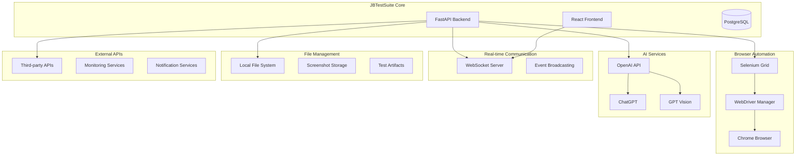

# Integration Components & Architecture

Complete documentation for external service integrations and communication patterns in JBTestSuite.

## 🔗 Integration Architecture Overview

JBTestSuite integrates with multiple external services and systems to provide comprehensive testing capabilities. The architecture emphasizes loose coupling, fault tolerance, and extensibility.

### Integration Stack
- **Selenium WebDriver** - Browser automation and web testing
- **OpenAI API** - AI-powered test generation and analysis
- **WebSocket** - Real-time communication and live updates
- **HTTP REST APIs** - External service communication
- **Message Queues** - Asynchronous task processing (future)
- **File Storage** - Artifact and screenshot management

### Integration Patterns


## 🌐 Selenium WebDriver Integration

### WebDriver Architecture

```python
# selenium/webdriver_manager.py - WebDriver lifecycle management
import asyncio
from typing import Optional, Dict, Any, List
from contextlib import asynccontextmanager
from selenium import webdriver
from selenium.webdriver.chrome.options import Options as ChromeOptions
from selenium.webdriver.common.desired_capabilities import DesiredCapabilities
from selenium.webdriver.remote.webdriver import WebDriver
from selenium.webdriver.support.ui import WebDriverWait
from selenium.webdriver.support import expected_conditions as EC
from selenium.webdriver.common.by import By
from selenium.common.exceptions import TimeoutException, WebDriverException

from src.core.config import settings
from src.core.logging import get_logger

logger = get_logger(__name__)

class WebDriverManager:
    """
    Manages WebDriver instances with connection pooling and error handling.
    
    Features:
    - Connection pooling for performance
    - Automatic retry and recovery
    - Screenshot capture on failures
    - Session management and cleanup
    - Multi-browser support
    """
    
    def __init__(self):
        self.active_drivers: Dict[str, WebDriver] = {}
        self.driver_pool: List[WebDriver] = []
        self.max_pool_size = 5
        self.selenium_hub_url = settings.SELENIUM_HUB_URL
        
    async def create_driver(
        self, 
        browser: str = "chrome",
        headless: bool = True,
        viewport_size: tuple = (1920, 1080),
        custom_options: Optional[Dict[str, Any]] = None
    ) -> WebDriver:
        """
        Create a new WebDriver instance with specified configuration.
        
        Args:
            browser: Browser type (chrome, firefox, safari)
            headless: Run in headless mode
            viewport_size: Browser viewport dimensions
            custom_options: Additional browser-specific options
            
        Returns:
            Configured WebDriver instance
            
        Raises:
            WebDriverException: If driver creation fails
        """
        try:
            if browser.lower() == "chrome":
                return await self._create_chrome_driver(
                    headless, viewport_size, custom_options
                )
            elif browser.lower() == "firefox":
                return await self._create_firefox_driver(
                    headless, viewport_size, custom_options
                )
            else:
                raise ValueError(f"Unsupported browser: {browser}")
                
        except Exception as e:
            logger.error(f"Failed to create WebDriver for {browser}: {str(e)}")
            raise WebDriverException(f"Driver creation failed: {str(e)}")
    
    async def _create_chrome_driver(
        self, 
        headless: bool,
        viewport_size: tuple,
        custom_options: Optional[Dict[str, Any]]
    ) -> WebDriver:
        """Create Chrome WebDriver with optimized settings."""
        
        chrome_options = ChromeOptions()
        
        # Basic options
        if headless:
            chrome_options.add_argument("--headless=new")
        
        chrome_options.add_argument(f"--window-size={viewport_size[0]},{viewport_size[1]}")
        chrome_options.add_argument("--no-sandbox")
        chrome_options.add_argument("--disable-dev-shm-usage")
        chrome_options.add_argument("--disable-gpu")
        chrome_options.add_argument("--disable-extensions")
        chrome_options.add_argument("--disable-background-timer-throttling")
        chrome_options.add_argument("--disable-renderer-backgrounding")
        chrome_options.add_argument("--disable-backgrounding-occluded-windows")
        
        # Performance optimizations
        chrome_options.add_argument("--disable-ipc-flooding-protection")
        chrome_options.add_argument("--disable-background-networking")
        chrome_options.add_argument("--disable-client-side-phishing-detection")
        chrome_options.add_argument("--disable-default-apps")
        chrome_options.add_argument("--disable-hang-monitor")
        chrome_options.add_argument("--disable-popup-blocking")
        chrome_options.add_argument("--disable-prompt-on-repost")
        chrome_options.add_argument("--disable-sync")
        chrome_options.add_argument("--disable-translate")
        chrome_options.add_argument("--disable-web-resources")
        chrome_options.add_argument("--disable-web-security")
        chrome_options.add_argument("--no-first-run")
        chrome_options.add_argument("--no-default-browser-check")
        
        # Custom preferences
        prefs = {
            "profile.default_content_setting_values": {
                "notifications": 2,  # Block notifications
                "geolocation": 2,    # Block location sharing
            },
            "profile.managed_default_content_settings": {
                "images": 2  # Don't load images for faster loading
            }
        }
        chrome_options.add_experimental_option("prefs", prefs)
        
        # Apply custom options
        if custom_options:
            for key, value in custom_options.items():
                if key == "arguments":
                    for arg in value:
                        chrome_options.add_argument(arg)
                elif key == "experimental_options":
                    for opt_key, opt_value in value.items():
                        chrome_options.add_experimental_option(opt_key, opt_value)
        
        # Desired capabilities for remote WebDriver
        capabilities = DesiredCapabilities.CHROME.copy()
        capabilities.update({
            "browserName": "chrome",
            "version": "latest",
            "enableVNC": True,
            "enableVideo": False,
            "screenResolution": f"{viewport_size[0]}x{viewport_size[1]}x24"
        })
        
        # Create driver
        driver = webdriver.Remote(
            command_executor=self.selenium_hub_url,
            desired_capabilities=capabilities,
            options=chrome_options
        )
        
        # Configure implicit waits and timeouts
        driver.implicitly_wait(10)
        driver.set_page_load_timeout(60)
        driver.set_script_timeout(30)
        
        # Set viewport size explicitly
        driver.set_window_size(*viewport_size)
        
        logger.info(f"Chrome WebDriver created successfully: {driver.session_id}")
        return driver
    
    @asynccontextmanager
    async def get_driver(self, **kwargs):
        """
        Context manager for WebDriver instances with automatic cleanup.
        
        Usage:
            async with webdriver_manager.get_driver(browser="chrome") as driver:
                driver.get("https://example.com")
                # Driver automatically cleaned up
        """
        driver = None
        try:
            # Try to get driver from pool
            if self.driver_pool:
                driver = self.driver_pool.pop()
                logger.debug("Reusing driver from pool")
            else:
                driver = await self.create_driver(**kwargs)
                logger.debug("Created new driver instance")
            
            yield driver
            
        except Exception as e:
            logger.error(f"Error during driver operation: {str(e)}")
            if driver:
                try:
                    # Take screenshot on error
                    await self.capture_error_screenshot(driver, str(e))
                except:
                    pass
            raise
        finally:
            if driver:
                await self.cleanup_driver(driver)
    
    async def cleanup_driver(self, driver: WebDriver) -> None:
        """
        Clean up WebDriver instance with proper error handling.
        
        Args:
            driver: WebDriver instance to cleanup
        """
        try:
            if driver:
                # Clear cookies and local storage
                driver.delete_all_cookies()
                driver.execute_script("localStorage.clear();")
                driver.execute_script("sessionStorage.clear();")
                
                # Return to pool if space available
                if len(self.driver_pool) < self.max_pool_size:
                    self.driver_pool.append(driver)
                    logger.debug("Driver returned to pool")
                else:
                    driver.quit()
                    logger.debug("Driver closed (pool full)")
                    
        except Exception as e:
            logger.error(f"Error during driver cleanup: {str(e)}")
            try:
                driver.quit()
            except:
                pass
    
    async def capture_error_screenshot(self, driver: WebDriver, error_msg: str) -> Optional[str]:
        """
        Capture screenshot when errors occur for debugging.
        
        Args:
            driver: WebDriver instance
            error_msg: Error message for filename
            
        Returns:
            Screenshot file path if successful
        """
        try:
            import hashlib
            from datetime import datetime
            
            timestamp = datetime.now().strftime("%Y%m%d_%H%M%S")
            error_hash = hashlib.md5(error_msg.encode()).hexdigest()[:8]
            filename = f"error_{timestamp}_{error_hash}.png"
            filepath = f"./artifacts/screenshots/{filename}"
            
            # Ensure directory exists
            import os
            os.makedirs(os.path.dirname(filepath), exist_ok=True)
            
            driver.save_screenshot(filepath)
            logger.info(f"Error screenshot saved: {filepath}")
            return filepath
            
        except Exception as e:
            logger.error(f"Failed to capture error screenshot: {str(e)}")
            return None
    
    async def health_check(self) -> Dict[str, Any]:
        """
        Perform health check on Selenium Grid connection.
        
        Returns:
            Health status information
        """
        try:
            # Test driver creation
            async with self.get_driver(browser="chrome", headless=True) as driver:
                driver.get("data:text/html,<html><body>Health Check</body></html>")
                title = driver.title
                
            return {
                "status": "healthy",
                "selenium_hub_url": self.selenium_hub_url,
                "pool_size": len(self.driver_pool),
                "max_pool_size": self.max_pool_size,
                "test_navigation": "success"
            }
            
        except Exception as e:
            return {
                "status": "unhealthy",
                "selenium_hub_url": self.selenium_hub_url,
                "error": str(e)
            }

# Global instance
webdriver_manager = WebDriverManager()
```

### Page Interaction Service

```python
# selenium/page_interactions.py - High-level browser interactions
from typing import Optional, Union, List, Any, Dict
from selenium.webdriver.remote.webdriver import WebDriver
from selenium.webdriver.remote.webelement import WebElement
from selenium.webdriver.common.by import By
from selenium.webdriver.support.ui import WebDriverWait, Select
from selenium.webdriver.support import expected_conditions as EC
from selenium.webdriver.common.action_chains import ActionChains
from selenium.webdriver.common.keys import Keys
from selenium.common.exceptions import TimeoutException, NoSuchElementException

from src.core.logging import get_logger

logger = get_logger(__name__)

class PageInteractions:
    """
    High-level browser interaction service with robust error handling.
    
    Provides intuitive methods for common web automation tasks with
    built-in waits, error handling, and logging.
    """
    
    def __init__(self, driver: WebDriver, default_timeout: int = 30):
        self.driver = driver
        self.wait = WebDriverWait(driver, default_timeout)
        self.actions = ActionChains(driver)
        self.default_timeout = default_timeout
        
    async def navigate_to(self, url: str, wait_for_load: bool = True) -> bool:
        """
        Navigate to URL with load verification.
        
        Args:
            url: Target URL
            wait_for_load: Wait for page to load completely
            
        Returns:
            True if navigation successful
        """
        try:
            logger.info(f"Navigating to: {url}")
            self.driver.get(url)
            
            if wait_for_load:
                # Wait for document ready state
                self.wait.until(
                    lambda driver: driver.execute_script(
                        "return document.readyState"
                    ) == "complete"
                )
                
            current_url = self.driver.current_url
            logger.info(f"Navigation successful. Current URL: {current_url}")
            return True
            
        except Exception as e:
            logger.error(f"Navigation failed to {url}: {str(e)}")
            return False
    
    async def find_element(
        self, 
        selector: str, 
        by: By = By.CSS_SELECTOR,
        timeout: Optional[int] = None
    ) -> Optional[WebElement]:
        """
        Find element with explicit wait and error handling.
        
        Args:
            selector: Element selector
            by: Selection method (CSS_SELECTOR, XPATH, ID, etc.)
            timeout: Custom timeout (uses default if None)
            
        Returns:
            WebElement if found, None otherwise
        """
        timeout = timeout or self.default_timeout
        
        try:
            element = WebDriverWait(self.driver, timeout).until(
                EC.presence_of_element_located((by, selector))
            )
            logger.debug(f"Element found: {selector}")
            return element
            
        except TimeoutException:
            logger.warning(f"Element not found within {timeout}s: {selector}")
            return None
        except Exception as e:
            logger.error(f"Error finding element {selector}: {str(e)}")
            return None
    
    async def click_element(
        self, 
        selector: str,
        by: By = By.CSS_SELECTOR,
        wait_after: float = 1.0,
        scroll_into_view: bool = True
    ) -> bool:
        """
        Click element with robust error handling.
        
        Args:
            selector: Element selector
            by: Selection method
            wait_after: Seconds to wait after click
            scroll_into_view: Scroll element into view before clicking
            
        Returns:
            True if click successful
        """
        try:
            element = await self.find_element(selector, by)
            if not element:
                return False
            
            # Scroll into view if requested
            if scroll_into_view:
                self.driver.execute_script(
                    "arguments[0].scrollIntoView({block: 'center'});", 
                    element
                )
                await asyncio.sleep(0.5)  # Brief pause for scroll
            
            # Wait for element to be clickable
            clickable_element = self.wait.until(
                EC.element_to_be_clickable((by, selector))
            )
            
            # Perform click
            clickable_element.click()
            logger.info(f"Clicked element: {selector}")
            
            # Wait after click if specified
            if wait_after > 0:
                await asyncio.sleep(wait_after)
                
            return True
            
        except Exception as e:
            logger.error(f"Click failed on {selector}: {str(e)}")
            return False
    
    async def type_text(
        self,
        selector: str,
        text: str,
        by: By = By.CSS_SELECTOR,
        clear_first: bool = True,
        typing_delay: float = 0.1
    ) -> bool:
        """
        Type text into input field with natural typing simulation.
        
        Args:
            selector: Input element selector
            text: Text to type
            by: Selection method
            clear_first: Clear field before typing
            typing_delay: Delay between keystrokes (seconds)
            
        Returns:
            True if typing successful
        """
        try:
            element = await self.find_element(selector, by)
            if not element:
                return False
            
            # Clear field if requested
            if clear_first:
                element.clear()
                await asyncio.sleep(0.2)
            
            # Type with delay for natural interaction
            if typing_delay > 0:
                for char in text:
                    element.send_keys(char)
                    await asyncio.sleep(typing_delay)
            else:
                element.send_keys(text)
            
            logger.info(f"Typed text into {selector}: {'*' * len(text) if 'password' in selector.lower() else text}")
            return True
            
        except Exception as e:
            logger.error(f"Type failed on {selector}: {str(e)}")
            return False
    
    async def wait_for_element(
        self,
        selector: str,
        by: By = By.CSS_SELECTOR,
        condition: str = "presence",
        timeout: Optional[int] = None
    ) -> bool:
        """
        Wait for element with various conditions.
        
        Args:
            selector: Element selector
            by: Selection method
            condition: Wait condition (presence, visible, clickable, invisible)
            timeout: Custom timeout
            
        Returns:
            True if condition met within timeout
        """
        timeout = timeout or self.default_timeout
        
        try:
            conditions_map = {
                "presence": EC.presence_of_element_located,
                "visible": EC.visibility_of_element_located,
                "clickable": EC.element_to_be_clickable,
                "invisible": EC.invisibility_of_element_located
            }
            
            if condition not in conditions_map:
                raise ValueError(f"Unknown condition: {condition}")
            
            WebDriverWait(self.driver, timeout).until(
                conditions_map[condition]((by, selector))
            )
            
            logger.debug(f"Wait condition '{condition}' met for: {selector}")
            return True
            
        except TimeoutException:
            logger.warning(f"Wait condition '{condition}' not met for {selector} within {timeout}s")
            return False
        except Exception as e:
            logger.error(f"Wait failed for {selector}: {str(e)}")
            return False
    
    async def get_element_text(
        self,
        selector: str,
        by: By = By.CSS_SELECTOR,
        attribute: Optional[str] = None
    ) -> Optional[str]:
        """
        Get text content or attribute value from element.
        
        Args:
            selector: Element selector
            by: Selection method
            attribute: Attribute name (if None, gets text content)
            
        Returns:
            Text content or attribute value
        """
        try:
            element = await self.find_element(selector, by)
            if not element:
                return None
            
            if attribute:
                value = element.get_attribute(attribute)
            else:
                value = element.text
            
            logger.debug(f"Got {'attribute ' + attribute if attribute else 'text'} from {selector}: {value}")
            return value
            
        except Exception as e:
            logger.error(f"Failed to get text from {selector}: {str(e)}")
            return None
    
    async def take_screenshot(self, filename: Optional[str] = None) -> Optional[str]:
        """
        Capture full page screenshot.
        
        Args:
            filename: Custom filename (auto-generated if None)
            
        Returns:
            Screenshot file path if successful
        """
        try:
            if not filename:
                from datetime import datetime
                timestamp = datetime.now().strftime("%Y%m%d_%H%M%S")
                filename = f"screenshot_{timestamp}.png"
            
            filepath = f"./artifacts/screenshots/{filename}"
            
            # Ensure directory exists
            import os
            os.makedirs(os.path.dirname(filepath), exist_ok=True)
            
            # Capture full page screenshot
            self.driver.save_screenshot(filepath)
            logger.info(f"Screenshot saved: {filepath}")
            return filepath
            
        except Exception as e:
            logger.error(f"Screenshot failed: {str(e)}")
            return None
    
    async def execute_javascript(self, script: str, *args) -> Any:
        """
        Execute JavaScript in browser context.
        
        Args:
            script: JavaScript code to execute
            *args: Arguments to pass to script
            
        Returns:
            Script return value
        """
        try:
            result = self.driver.execute_script(script, *args)
            logger.debug(f"JavaScript executed: {script[:100]}...")
            return result
            
        except Exception as e:
            logger.error(f"JavaScript execution failed: {str(e)}")
            return None
    
    async def scroll_to_element(self, selector: str, by: By = By.CSS_SELECTOR) -> bool:
        """
        Scroll element into view.
        
        Args:
            selector: Element selector
            by: Selection method
            
        Returns:
            True if scroll successful
        """
        try:
            element = await self.find_element(selector, by)
            if not element:
                return False
            
            self.driver.execute_script(
                "arguments[0].scrollIntoView({behavior: 'smooth', block: 'center'});", 
                element
            )
            
            await asyncio.sleep(1)  # Wait for smooth scroll
            logger.debug(f"Scrolled to element: {selector}")
            return True
            
        except Exception as e:
            logger.error(f"Scroll failed for {selector}: {str(e)}")
            return False
```

## 🤖 OpenAI API Integration

### AI Client Service

```python
# ai/openai_client.py - OpenAI API integration with retry logic
import asyncio
from typing import Optional, List, Dict, Any, Union
import openai
from openai import AsyncOpenAI
import base64
from io import BytesIO
from PIL import Image

from src.core.config import settings
from src.core.logging import get_logger
from src.core.exceptions import ExternalServiceError

logger = get_logger(__name__)

class OpenAIClient:
    """
    OpenAI API client with comprehensive error handling and retry logic.
    
    Features:
    - Automatic retry with exponential backoff
    - Rate limiting handling
    - Token usage tracking
    - Multiple model support
    - Vision API integration
    - Structured output generation
    """
    
    def __init__(self):
        if not settings.OPENAI_API_KEY:
            logger.warning("OpenAI API key not configured - AI features disabled")
            self.client = None
            return
            
        self.client = AsyncOpenAI(api_key=settings.OPENAI_API_KEY)
        self.max_retries = 3
        self.base_delay = 1.0
        self.max_delay = 60.0
        
        # Model configurations
        self.models = {
            "gpt-4": {
                "max_tokens": 8192,
                "cost_per_token": 0.03 / 1000,
                "capabilities": ["text", "reasoning"]
            },
            "gpt-4-vision-preview": {
                "max_tokens": 4096,
                "cost_per_token": 0.01 / 1000,
                "capabilities": ["text", "vision", "reasoning"]
            },
            "gpt-3.5-turbo": {
                "max_tokens": 4096,
                "cost_per_token": 0.002 / 1000,
                "capabilities": ["text", "fast"]
            }
        }
        
    async def generate_test_case(
        self,
        requirements: str,
        context: Optional[Dict[str, Any]] = None,
        model: str = "gpt-4"
    ) -> Optional[Dict[str, Any]]:
        """
        Generate test case from natural language requirements.
        
        Args:
            requirements: Natural language test requirements
            context: Additional context (existing tests, application info)
            model: OpenAI model to use
            
        Returns:
            Generated test case structure
        """
        if not self.client:
            logger.error("OpenAI client not initialized")
            return None
        
        try:
            system_prompt = self._build_test_generation_prompt()
            user_prompt = self._build_user_requirements_prompt(requirements, context)
            
            response = await self._chat_completion_with_retry(
                model=model,
                messages=[
                    {"role": "system", "content": system_prompt},
                    {"role": "user", "content": user_prompt}
                ],
                temperature=0.3,  # Lower temperature for consistent output
                response_format={"type": "json_object"}
            )
            
            if not response:
                return None
            
            # Parse and validate response
            import json
            test_case = json.loads(response.choices[0].message.content)
            
            # Validate required fields
            if not self._validate_generated_test_case(test_case):
                logger.error("Generated test case failed validation")
                return None
            
            logger.info(f"Generated test case: {test_case.get('name', 'Unknown')}")
            return test_case
            
        except Exception as e:
            logger.error(f"Test case generation failed: {str(e)}")
            raise ExternalServiceError(f"AI test generation failed: {str(e)}")
    
    async def analyze_screenshot(
        self,
        image_path: str,
        analysis_type: str = "general",
        context: Optional[str] = None
    ) -> Optional[Dict[str, Any]]:
        """
        Analyze screenshot using GPT Vision API.
        
        Args:
            image_path: Path to screenshot image
            analysis_type: Type of analysis (general, error, ui_validation)
            context: Additional context for analysis
            
        Returns:
            Analysis results
        """
        if not self.client:
            logger.error("OpenAI client not initialized")
            return None
        
        try:
            # Encode image to base64
            base64_image = await self._encode_image(image_path)
            if not base64_image:
                return None
            
            # Build analysis prompt based on type
            system_prompt = self._build_vision_analysis_prompt(analysis_type)
            user_content = [
                {
                    "type": "text",
                    "text": f"Analyze this screenshot. Context: {context or 'No additional context provided.'}"
                },
                {
                    "type": "image_url",
                    "image_url": {
                        "url": f"data:image/png;base64,{base64_image}",
                        "detail": "high"
                    }
                }
            ]
            
            response = await self._chat_completion_with_retry(
                model="gpt-4-vision-preview",
                messages=[
                    {"role": "system", "content": system_prompt},
                    {"role": "user", "content": user_content}
                ],
                max_tokens=1000,
                temperature=0.2
            )
            
            if not response:
                return None
            
            analysis = response.choices[0].message.content
            
            # Structure the response
            result = {
                "analysis_type": analysis_type,
                "image_path": image_path,
                "analysis": analysis,
                "timestamp": datetime.utcnow().isoformat(),
                "model_used": "gpt-4-vision-preview",
                "tokens_used": response.usage.total_tokens if response.usage else 0
            }
            
            logger.info(f"Screenshot analysis completed: {analysis_type}")
            return result
            
        except Exception as e:
            logger.error(f"Screenshot analysis failed: {str(e)}")
            raise ExternalServiceError(f"AI vision analysis failed: {str(e)}")
    
    async def _chat_completion_with_retry(
        self,
        model: str,
        messages: List[Dict[str, Any]],
        **kwargs
    ) -> Optional[Any]:
        """
        Chat completion with exponential backoff retry logic.
        
        Args:
            model: OpenAI model name
            messages: Chat messages
            **kwargs: Additional parameters
            
        Returns:
            OpenAI response or None if failed
        """
        for attempt in range(self.max_retries):
            try:
                response = await self.client.chat.completions.create(
                    model=model,
                    messages=messages,
                    **kwargs
                )
                
                # Log usage for monitoring
                if response.usage:
                    logger.debug(f"OpenAI API usage - Prompt: {response.usage.prompt_tokens}, "
                               f"Completion: {response.usage.completion_tokens}, "
                               f"Total: {response.usage.total_tokens}")
                
                return response
                
            except openai.RateLimitError as e:
                wait_time = min(self.base_delay * (2 ** attempt), self.max_delay)
                logger.warning(f"OpenAI rate limit hit, waiting {wait_time}s (attempt {attempt + 1})")
                await asyncio.sleep(wait_time)
                
            except openai.APIError as e:
                if attempt == self.max_retries - 1:
                    logger.error(f"OpenAI API error after {self.max_retries} attempts: {str(e)}")
                    raise ExternalServiceError(f"OpenAI API error: {str(e)}")
                
                wait_time = min(self.base_delay * (2 ** attempt), self.max_delay)
                logger.warning(f"OpenAI API error, retrying in {wait_time}s: {str(e)}")
                await asyncio.sleep(wait_time)
                
            except Exception as e:
                logger.error(f"Unexpected error in OpenAI request: {str(e)}")
                raise ExternalServiceError(f"OpenAI request failed: {str(e)}")
        
        return None
    
    async def _encode_image(self, image_path: str) -> Optional[str]:
        """
        Encode image to base64 for Vision API.
        
        Args:
            image_path: Path to image file
            
        Returns:
            Base64 encoded image string
        """
        try:
            # Open and optimize image
            with Image.open(image_path) as img:
                # Convert to RGB if necessary
                if img.mode != 'RGB':
                    img = img.convert('RGB')
                
                # Resize if too large (Vision API has size limits)
                max_size = (2048, 2048)
                if img.size[0] > max_size[0] or img.size[1] > max_size[1]:
                    img.thumbnail(max_size, Image.Resampling.LANCZOS)
                
                # Save to bytes
                buffer = BytesIO()
                img.save(buffer, format='PNG', optimize=True)
                buffer.seek(0)
                
                # Encode to base64
                image_base64 = base64.b64encode(buffer.read()).decode('utf-8')
                
            logger.debug(f"Image encoded: {image_path}")
            return image_base64
            
        except Exception as e:
            logger.error(f"Image encoding failed for {image_path}: {str(e)}")
            return None
    
    def _build_test_generation_prompt(self) -> str:
        """Build system prompt for test case generation."""
        return """
        You are an expert test automation engineer. Generate comprehensive test cases from natural language requirements.
        
        Your output must be valid JSON with this exact structure:
        {
            "name": "Descriptive test case name",
            "description": "Detailed test description",
            "category": "Test category (e.g., authentication, ui, api)",
            "priority": "critical|high|medium|low",
            "tags": ["tag1", "tag2"],
            "is_automated": true,
            "retry_count": 3,
            "steps": [
                {
                    "order_index": 1,
                    "name": "Step name",
                    "description": "Step description",
                    "step_type": "navigate|click|type|wait|assert|screenshot",
                    "selector": "CSS selector or null",
                    "input_data": "Input data or null",
                    "expected_result": "Expected outcome",
                    "timeout_seconds": 30,
                    "is_optional": false,
                    "continue_on_failure": false
                }
            ]
        }
        
        Guidelines:
        - Create realistic, executable test steps
        - Use appropriate selectors (CSS preferred)
        - Include proper assertions
        - Consider edge cases and error scenarios
        - Make steps atomic and clear
        """
    
    def _build_user_requirements_prompt(
        self, 
        requirements: str, 
        context: Optional[Dict[str, Any]]
    ) -> str:
        """Build user prompt with requirements and context."""
        prompt = f"Generate a test case for: {requirements}\n\n"
        
        if context:
            prompt += "Additional Context:\n"
            if context.get("application_url"):
                prompt += f"Application URL: {context['application_url']}\n"
            if context.get("existing_tests"):
                prompt += f"Related tests: {', '.join(context['existing_tests'])}\n"
            if context.get("page_elements"):
                prompt += f"Known page elements: {context['page_elements']}\n"
        
        return prompt
    
    def _build_vision_analysis_prompt(self, analysis_type: str) -> str:
        """Build system prompt for vision analysis."""
        prompts = {
            "general": """
            Analyze this screenshot and describe what you see. Focus on:
            - UI elements and layout
            - Visible text and buttons
            - Any errors or issues
            - User interface state
            """,
            
            "error": """
            Analyze this screenshot for errors or issues. Look for:
            - Error messages or dialogs
            - Broken UI elements
            - Missing content
            - Layout problems
            - Console errors (if visible)
            Provide specific details about any problems found.
            """,
            
            "ui_validation": """
            Validate this UI screenshot against expected behavior. Check for:
            - Proper element positioning
            - Correct text content
            - Appropriate styling
            - Responsive design issues
            - Accessibility concerns
            Provide a detailed assessment of the UI quality.
            """
        }
        
        return prompts.get(analysis_type, prompts["general"])
    
    def _validate_generated_test_case(self, test_case: Dict[str, Any]) -> bool:
        """Validate generated test case structure."""
        required_fields = ["name", "steps"]
        
        for field in required_fields:
            if field not in test_case:
                logger.error(f"Missing required field: {field}")
                return False
        
        if not isinstance(test_case["steps"], list) or not test_case["steps"]:
            logger.error("Test case must have at least one step")
            return False
        
        for i, step in enumerate(test_case["steps"]):
            if not isinstance(step, dict):
                logger.error(f"Step {i} must be a dictionary")
                return False
            
            if "step_type" not in step or step["step_type"] not in [
                "navigate", "click", "type", "wait", "assert", "screenshot", "custom"
            ]:
                logger.error(f"Step {i} has invalid step_type")
                return False
        
        return True
    
    async def get_api_usage_stats(self) -> Dict[str, Any]:
        """Get API usage statistics for monitoring."""
        # This would typically connect to OpenAI's usage API
        # For now, return placeholder data
        return {
            "requests_today": 0,
            "tokens_used_today": 0,
            "estimated_cost_today": 0.0,
            "rate_limit_remaining": 1000,
            "models_used": list(self.models.keys())
        }

# Global client instance
openai_client = OpenAIClient()
```

## 📡 WebSocket Real-time Communication

### WebSocket Server Implementation

```python
# api/websocket.py - Real-time communication server
import asyncio
import json
from typing import Dict, Set, Any, Optional, List
from datetime import datetime
from fastapi import WebSocket, WebSocketDisconnect
from fastapi.routing import APIRouter
import uuid

from src.core.logging import get_logger

logger = get_logger(__name__)

class ConnectionManager:
    """
    WebSocket connection manager with room-based broadcasting.
    
    Features:
    - Connection lifecycle management
    - Room-based message broadcasting
    - Message queuing for offline clients
    - Heartbeat monitoring
    - Automatic reconnection handling
    """
    
    def __init__(self):
        # Active connections by connection ID
        self.active_connections: Dict[str, WebSocket] = {}
        
        # User to connection mapping
        self.user_connections: Dict[str, Set[str]] = {}
        
        # Room subscriptions (connection_id -> set of rooms)
        self.connection_rooms: Dict[str, Set[str]] = {}
        
        # Room subscribers (room -> set of connection_ids)
        self.room_connections: Dict[str, Set[str]] = {}
        
        # Message queues for offline users
        self.message_queues: Dict[str, List[Dict[str, Any]]] = {}
        
        # Connection metadata
        self.connection_metadata: Dict[str, Dict[str, Any]] = {}
        
    async def connect(
        self, 
        websocket: WebSocket, 
        user_id: Optional[str] = None,
        connection_metadata: Optional[Dict[str, Any]] = None
    ) -> str:
        """
        Accept WebSocket connection and register client.
        
        Args:
            websocket: WebSocket connection
            user_id: Optional user identifier
            connection_metadata: Additional connection info
            
        Returns:
            Unique connection ID
        """
        await websocket.accept()
        
        # Generate unique connection ID
        connection_id = str(uuid.uuid4())
        
        # Store connection
        self.active_connections[connection_id] = websocket
        self.connection_rooms[connection_id] = set()
        
        # Associate with user if provided
        if user_id:
            if user_id not in self.user_connections:
                self.user_connections[user_id] = set()
            self.user_connections[user_id].add(connection_id)
        
        # Store metadata
        self.connection_metadata[connection_id] = {
            "user_id": user_id,
            "connected_at": datetime.utcnow(),
            "last_heartbeat": datetime.utcnow(),
            **(connection_metadata or {})
        }
        
        logger.info(f"WebSocket connected: {connection_id} (user: {user_id})")
        
        # Send queued messages if user has any
        if user_id and user_id in self.message_queues:
            for message in self.message_queues[user_id]:
                await self.send_personal_message(message, connection_id)
            del self.message_queues[user_id]
        
        return connection_id
    
    async def disconnect(self, connection_id: str) -> None:
        """
        Disconnect and cleanup client connection.
        
        Args:
            connection_id: Connection to disconnect
        """
        if connection_id not in self.active_connections:
            return
        
        websocket = self.active_connections[connection_id]
        metadata = self.connection_metadata.get(connection_id, {})
        user_id = metadata.get("user_id")
        
        # Remove from active connections
        del self.active_connections[connection_id]
        
        # Clean up user associations
        if user_id and user_id in self.user_connections:
            self.user_connections[user_id].discard(connection_id)
            if not self.user_connections[user_id]:
                del self.user_connections[user_id]
        
        # Clean up room subscriptions
        if connection_id in self.connection_rooms:
            for room in self.connection_rooms[connection_id]:
                if room in self.room_connections:
                    self.room_connections[room].discard(connection_id)
                    if not self.room_connections[room]:
                        del self.room_connections[room]
            del self.connection_rooms[connection_id]
        
        # Clean up metadata
        if connection_id in self.connection_metadata:
            del self.connection_metadata[connection_id]
        
        logger.info(f"WebSocket disconnected: {connection_id} (user: {user_id})")
    
    async def join_room(self, connection_id: str, room: str) -> bool:
        """
        Subscribe connection to a room for targeted broadcasting.
        
        Args:
            connection_id: Connection to subscribe
            room: Room identifier
            
        Returns:
            True if successfully joined
        """
        if connection_id not in self.active_connections:
            return False
        
        # Add to connection's rooms
        self.connection_rooms[connection_id].add(room)
        
        # Add to room's connections
        if room not in self.room_connections:
            self.room_connections[room] = set()
        self.room_connections[room].add(connection_id)
        
        logger.debug(f"Connection {connection_id} joined room: {room}")
        return True
    
    async def leave_room(self, connection_id: str, room: str) -> bool:
        """
        Unsubscribe connection from a room.
        
        Args:
            connection_id: Connection to unsubscribe
            room: Room identifier
            
        Returns:
            True if successfully left
        """
        if connection_id not in self.connection_rooms:
            return False
        
        # Remove from connection's rooms
        self.connection_rooms[connection_id].discard(room)
        
        # Remove from room's connections
        if room in self.room_connections:
            self.room_connections[room].discard(connection_id)
            if not self.room_connections[room]:
                del self.room_connections[room]
        
        logger.debug(f"Connection {connection_id} left room: {room}")
        return True
    
    async def send_personal_message(
        self, 
        message: Dict[str, Any], 
        connection_id: str
    ) -> bool:
        """
        Send message to specific connection.
        
        Args:
            message: Message data
            connection_id: Target connection
            
        Returns:
            True if message sent successfully
        """
        if connection_id not in self.active_connections:
            logger.warning(f"Connection {connection_id} not found for personal message")
            return False
        
        try:
            websocket = self.active_connections[connection_id]
            await websocket.send_text(json.dumps(message))
            logger.debug(f"Personal message sent to {connection_id}: {message.get('type', 'unknown')}")
            return True
            
        except Exception as e:
            logger.error(f"Failed to send personal message to {connection_id}: {str(e)}")
            await self.disconnect(connection_id)
            return False
    
    async def send_user_message(
        self, 
        message: Dict[str, Any], 
        user_id: str,
        queue_if_offline: bool = True
    ) -> int:
        """
        Send message to all connections for a user.
        
        Args:
            message: Message data
            user_id: Target user
            queue_if_offline: Queue message if user offline
            
        Returns:
            Number of connections message was sent to
        """
        if user_id not in self.user_connections:
            if queue_if_offline:
                if user_id not in self.message_queues:
                    self.message_queues[user_id] = []
                self.message_queues[user_id].append(message)
                logger.debug(f"Message queued for offline user: {user_id}")
            return 0
        
        sent_count = 0
        failed_connections = []
        
        for connection_id in self.user_connections[user_id].copy():
            try:
                websocket = self.active_connections[connection_id]
                await websocket.send_text(json.dumps(message))
                sent_count += 1
            except Exception as e:
                logger.error(f"Failed to send user message to {connection_id}: {str(e)}")
                failed_connections.append(connection_id)
        
        # Clean up failed connections
        for connection_id in failed_connections:
            await self.disconnect(connection_id)
        
        logger.debug(f"User message sent to {sent_count} connections for user: {user_id}")
        return sent_count
    
    async def broadcast_to_room(
        self, 
        message: Dict[str, Any], 
        room: str,
        exclude_connections: Optional[Set[str]] = None
    ) -> int:
        """
        Broadcast message to all connections in a room.
        
        Args:
            message: Message data
            room: Target room
            exclude_connections: Connections to exclude from broadcast
            
        Returns:
            Number of connections message was sent to
        """
        if room not in self.room_connections:
            logger.debug(f"No connections in room: {room}")
            return 0
        
        exclude_connections = exclude_connections or set()
        sent_count = 0
        failed_connections = []
        
        for connection_id in self.room_connections[room].copy():
            if connection_id in exclude_connections:
                continue
                
            try:
                websocket = self.active_connections[connection_id]
                await websocket.send_text(json.dumps(message))
                sent_count += 1
            except Exception as e:
                logger.error(f"Failed to broadcast to {connection_id}: {str(e)}")
                failed_connections.append(connection_id)
        
        # Clean up failed connections
        for connection_id in failed_connections:
            await self.disconnect(connection_id)
        
        logger.debug(f"Room broadcast sent to {sent_count} connections in room: {room}")
        return sent_count
    
    async def broadcast_to_all(
        self, 
        message: Dict[str, Any],
        exclude_connections: Optional[Set[str]] = None
    ) -> int:
        """
        Broadcast message to all active connections.
        
        Args:
            message: Message data
            exclude_connections: Connections to exclude
            
        Returns:
            Number of connections message was sent to
        """
        exclude_connections = exclude_connections or set()
        sent_count = 0
        failed_connections = []
        
        for connection_id in list(self.active_connections.keys()):
            if connection_id in exclude_connections:
                continue
                
            try:
                websocket = self.active_connections[connection_id]
                await websocket.send_text(json.dumps(message))
                sent_count += 1
            except Exception as e:
                logger.error(f"Failed to broadcast to {connection_id}: {str(e)}")
                failed_connections.append(connection_id)
        
        # Clean up failed connections
        for connection_id in failed_connections:
            await self.disconnect(connection_id)
        
        logger.info(f"Global broadcast sent to {sent_count} connections")
        return sent_count
    
    def get_connection_stats(self) -> Dict[str, Any]:
        """
        Get current connection statistics.
        
        Returns:
            Connection statistics
        """
        return {
            "total_connections": len(self.active_connections),
            "unique_users": len(self.user_connections),
            "active_rooms": len(self.room_connections),
            "queued_messages": sum(len(queue) for queue in self.message_queues.values()),
            "room_distribution": {
                room: len(connections) 
                for room, connections in self.room_connections.items()
            }
        }

# Global connection manager
connection_manager = ConnectionManager()

# WebSocket router
websocket_router = APIRouter()

@websocket_router.websocket("/ws")
async def websocket_endpoint(websocket: WebSocket):
    """
    Main WebSocket endpoint for real-time communication.
    
    Handles connection lifecycle and message routing.
    """
    connection_id = None
    
    try:
        # Accept connection
        connection_id = await connection_manager.connect(websocket)
        
        # Send connection confirmation
        await connection_manager.send_personal_message({
            "type": "connection_confirmed",
            "connection_id": connection_id,
            "timestamp": datetime.utcnow().isoformat()
        }, connection_id)
        
        # Main message loop
        while True:
            try:
                # Receive message from client
                data = await websocket.receive_text()
                message = json.loads(data)
                
                # Handle different message types
                await handle_websocket_message(connection_id, message)
                
            except WebSocketDisconnect:
                logger.info(f"WebSocket client disconnected: {connection_id}")
                break
            except json.JSONDecodeError:
                logger.error(f"Invalid JSON received from {connection_id}")
                await connection_manager.send_personal_message({
                    "type": "error",
                    "message": "Invalid JSON format"
                }, connection_id)
            except Exception as e:
                logger.error(f"Error handling message from {connection_id}: {str(e)}")
                await connection_manager.send_personal_message({
                    "type": "error",
                    "message": "Message processing failed"
                }, connection_id)
    
    except Exception as e:
        logger.error(f"WebSocket connection error: {str(e)}")
    
    finally:
        if connection_id:
            await connection_manager.disconnect(connection_id)

async def handle_websocket_message(connection_id: str, message: Dict[str, Any]) -> None:
    """
    Handle incoming WebSocket messages.
    
    Args:
        connection_id: Source connection ID
        message: Parsed message data
    """
    message_type = message.get("type")
    
    if message_type == "join_room":
        room = message.get("room")
        if room:
            await connection_manager.join_room(connection_id, room)
            await connection_manager.send_personal_message({
                "type": "room_joined",
                "room": room
            }, connection_id)
    
    elif message_type == "leave_room":
        room = message.get("room")
        if room:
            await connection_manager.leave_room(connection_id, room)
            await connection_manager.send_personal_message({
                "type": "room_left",
                "room": room
            }, connection_id)
    
    elif message_type == "heartbeat":
        # Update last heartbeat timestamp
        if connection_id in connection_manager.connection_metadata:
            connection_manager.connection_metadata[connection_id]["last_heartbeat"] = datetime.utcnow()
        
        await connection_manager.send_personal_message({
            "type": "heartbeat_ack"
        }, connection_id)
    
    elif message_type == "get_stats":
        stats = connection_manager.get_connection_stats()
        await connection_manager.send_personal_message({
            "type": "stats",
            "data": stats
        }, connection_id)
    
    else:
        logger.warning(f"Unknown message type from {connection_id}: {message_type}")
        await connection_manager.send_personal_message({
            "type": "error",
            "message": f"Unknown message type: {message_type}"
        }, connection_id)

# Test execution event broadcasting
async def broadcast_test_execution_event(
    event_type: str, 
    test_execution_id: str,
    data: Dict[str, Any]
) -> None:
    """
    Broadcast test execution events to subscribers.
    
    Args:
        event_type: Type of event (started, progress, completed, failed)
        test_execution_id: Test execution identifier
        data: Event data
    """
    message = {
        "type": "test_execution_event",
        "event_type": event_type,
        "test_execution_id": test_execution_id,
        "data": data,
        "timestamp": datetime.utcnow().isoformat()
    }
    
    # Broadcast to test execution room
    room = f"test_execution:{test_execution_id}"
    await connection_manager.broadcast_to_room(message, room)
    
    # Also broadcast to general test events room
    await connection_manager.broadcast_to_room(message, "test_events")
```

---

*This integration architecture provides robust connectivity to external services with comprehensive error handling, monitoring, and scalability features.*